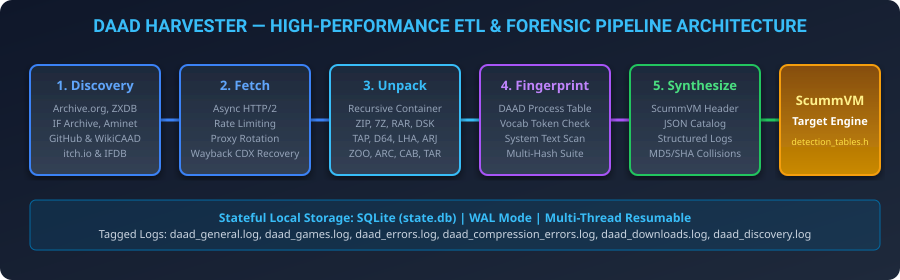

# DAAD Harvester

**DAAD Harvester** is a local, resumable pipeline for finding public DAAD-related game artifacts, downloading only compatible files, unpacking them safely, and producing evidence that can support downstream ScummVM detection work. It is designed for preservation research, not as a general web crawler or a promise that every discovered file is a verified DAAD game.

DAAD (Designed Action Adventure Designer) is the cross-platform adventure authoring system created for Spanish publisher Aventuras AD. It was used on several home-computer platforms and remains relevant to preservation and modern homebrew tooling.[1] The problem this project solves is not merely finding game titles: archive catalogs, metadata pages, purchase pages, snapshots, and direct binary files are fundamentally different resources. Only the last category can safely enter a download-and-analysis pipeline.

> **Core principle:** Discovery is intentionally conservative. A source URL is admitted only when it is a public HTTP(S) link to a supported archive, tape, disk, or database format. Catalog pages and human-facing download pages are evidence, not download jobs.

## Why this project exists

DAAD material is fragmented across retro archives, repository hosts, and community catalogs. Each source has its own search interface, naming conventions, link structure, and failure modes. A naïve scraper produces a large queue of dead URLs, HTML pages, unrelated games, and files from other authoring engines. That wastes bandwidth, obscures evidence, and makes the results impossible to trust.

DAAD Harvester separates those concerns. It uses source-specific adapters to discover candidate files, validates the direct-download contract before queueing them, persists progress in SQLite, and applies increasingly expensive analysis only after acquisition. The design favors **traceability, repeatability, and safe rejection** over speculative coverage.

| Design objective | Implementation choice | Practical result |
| --- | --- | --- |
| Avoid guessed inputs | The bundled seed catalog is empty until a maintainer adds a manually verified direct file URL. | A clean run does not begin with stale archive paths or HTML pages. |
| Keep discovery source-aware | Each adapter knows the public API or bounded catalog it uses. | Internet Archive metadata, GitHub default branches, ZXInfo search results, and World of Spectrum detail pages are handled differently. |
| Reject non-artifacts early | Discovery accepts only supported filenames and trusted source-specific download patterns. | Catalog pages, screenshots, purchase pages, and unsupported snapshots do not enter the fetch queue. |
| Preserve diagnostic evidence | Source records, HTTP outcomes, logs, hashes, and outputs are written locally. | A run can be resumed, audited, or compared without repeating successful work. |
| Limit damage from malformed archives | Recursive extraction is bounded and checks suspicious compression ratios. | The pipeline can inspect retro containers without treating every archive as safe. |

## Architecture

The pipeline has five ordered stages. The SQLite state database records the state of every source and lets later invocations continue from the last completed stage.



| Stage | Module | Input | Output | Why it is separate |
| --- | --- | --- | --- | --- |
| Discover | `daad_harvester.discover` | Public catalogs and APIs | Pending direct artifact URLs | Source-specific logic is isolated from downloading. |
| Fetch | `daad_harvester.fetch` | Pending URLs | Local files plus HTTP metadata | The downloader streams data, rejects HTML/JSON and empty responses, and records final failures. |
| Unpack | `daad_harvester.unpack` | Downloaded files | Extracted artifacts | Archive handling is isolated from network behavior and supports nested containers. |
| Fingerprint | `daad_harvester.fingerprint` | Extracted artifacts | DAAD candidate evidence and hashes | Binary heuristics are applied only to local bytes. |
| Synthesize and report | `daad_harvester.synthesize`, `daad_harvester.report` | Verified records | JSON catalog, C++ detection candidates, and report files | Output generation is deterministic and can be repeated without re-downloading. |

### Discovery sources and trust boundaries

The current adapters are deliberately categorized by what they can prove. A source is not treated as healthy merely because its website responds with HTTP 200.

| Source | Discovery contract | Current behavior |
| --- | --- | --- |
| [Internet Archive][2] | Advanced Search identifies relevant items; the item metadata response supplies the real file names. | Queues supported files from items whose metadata identifies DAAD or Aventuras AD material. |
| GitHub | Public repository search returns a repository’s actual `default_branch`. | Queues a repository ZIP only when repository metadata is DAAD-related; it does not assume `main`. |
| Aminet | The public `daad` search page provides Amiga file links. | Queues direct supported files associated with the DAAD query. |
| [ZXInfo / ZXDB][3] | The documented `/v3/search` API provides release-file paths. | Resolves compatible DAAD release files through Spectrum Computing; excludes PAWS, Quill, GAC, SWAN, and snapshot formats. |
| [World of Spectrum][4] | The bounded Aventuras AD publisher catalog leads to game pages that explicitly state DAAD authorship. | Queues only host-local TAP, TZX, and DSK ZIP archives from those verified detail pages. |
| WikiCAAD and IFDB | Public structured search can expose outbound direct artifact links. | Runs conservatively; zero results are valid when no direct downloadable artifact is present. |
| itch.io | Public tag and game pages may expose direct file URLs. | Does **not** queue game, account, login, or purchase pages. Paid or gated downloads remain out of scope. |
| DuckDuckGo HTML | A fallback result page may contain direct file links. | Uses the current result selector and queues only direct supported files. HTTP 202 or rate-limited responses are logged rather than disguised as success. |
| IF Archive | No maintained, DAAD-specific index is currently configured. | Explicitly skipped rather than crawling broad directories full of unrelated interactive fiction. |

World of Spectrum identifies *La Aventura Original* as an available 1989 Aventuras AD text adventure authored with DAAD and exposes direct tape and disk-image archives.[4] ZXInfo documents its v3 API as the public search interface for ZXDB data and identifies the `/search` endpoint as the primary query interface.[3]

### What a successful run means

A successful discovery phase means that adapters completed and persisted a queue of direct candidate files. It does **not** mean every file is DAAD, every remote URL will remain available, or every archive can be unpacked on every operating system. The fingerprint stage is the authority for identifying plausible DAAD payloads. This distinction is essential when working with historical archives.

## Requirements

| Requirement | Minimum | Notes |
| --- | --- | --- |
| Python | 3.10 or newer | Tested in the project’s automated suite on Python 3.10 and 3.12. |
| Network access | Public HTTPS access | Required for discovery and fetching. Source availability can change. |
| Disk space | Varies by run | Use a dedicated output directory for downloaded and extracted files. |
| Extraction tools | Recommended on Linux | Needed for broad support of legacy container formats such as LHA, RAR, ARJ, and CAB. |

### Ubuntu or Debian

```bash
sudo apt-get update
sudo apt-get install -y 7zip unzip unar libarchive-tools unrar-free cabextract arj lhasa
```

### macOS

Install the required extraction tools with Homebrew, then install the Python package as shown below. Exact package availability can vary by Homebrew release.

```bash
brew install p7zip unar libarchive unrar cabextract arj lhasa
```

## Installation

Clone the repository, create an isolated environment if desired, and install the package. The project includes `pyproject.toml`, so the command-line entry point and tests do not depend on a manually set `PYTHONPATH`.

```bash
git clone https://github.com/boolforge/DAAD-harvester.git
cd DAAD-harvester

python3 -m venv .venv
source .venv/bin/activate
python -m pip install --upgrade pip
python -m pip install -e ".[dev]"
```

For runtime use without test tooling, install `.` instead of `.[dev]`.

```bash
python -m pip install .
```

Confirm the installation before starting a networked run.

```bash
daad-harvester --version
daad-harvester --help
```

## Quick start

Start with discovery in a fresh directory. This is the safest way to inspect the current source queue before downloading anything.

```bash
daad-harvester --phase discover --output-dir ./output
```

Inspect `output/logs/daad_discovery.log` and the `sources` table in `output/state.db`. When the source queue looks appropriate, run the complete pipeline.

```bash
daad-harvester --phase all --parallel 4 --output-dir ./output
```

Use a smaller worker count for respectful network behavior or unstable connections. The default is eight download workers; lower values are often more appropriate for a first archival run.

## Running individual phases

Each phase can run independently against the same output directory. This makes failures and source behavior easier to diagnose.

| Command | Intended use |
| --- | --- |
| `daad-harvester --phase discover --output-dir ./output` | Query live catalogs and build a direct-file queue. |
| `daad-harvester --phase fetch --parallel 4 --output-dir ./output` | Download pending sources and record HTTP content metadata. |
| `daad-harvester --phase unpack --output-dir ./output` | Recursively extract downloaded containers and disk images. |
| `daad-harvester --phase fingerprint --output-dir ./output` | Analyze extracted artifacts for DAAD evidence. |
| `daad-harvester --phase synthesize --output-dir ./output` | Generate catalog, detection-table candidates, and report files from stored records. |
| `daad-harvester --phase all --output-dir ./output` | Execute the full ordered pipeline. |

The terminal dashboard is optional. Use it only in an interactive terminal.

```bash
daad-harvester --phase all --tui --output-dir ./output
```

## Configuration

Runtime settings are provided through command-line options or environment variables with the `DAAD_` prefix.

| Setting | Default | Purpose |
| --- | --- | --- |
| `DAAD_REQUEST_TIMEOUT` | `30` seconds | Per-request network timeout. |
| `DAAD_MAX_RETRIES` | `3` | Maximum attempts for one network operation. |
| `DAAD_RATE_LIMIT_PER_DOMAIN` | `1.0` | Request rate per hostname. |
| `DAAD_PARALLEL_WORKERS` | `8` | Default fetch parallelism. |
| `DAAD_MAX_UNPACK_DEPTH` | `5` | Maximum recursive extraction depth. |
| `DAAD_ZIP_BOMB_MAX_RATIO` | `100.0` | Maximum extracted/compressed ratio before a container is rejected. |
| `DAAD_LOG_LEVEL` | `INFO` | Standard logging threshold. |

A proxy list can be supplied at runtime. The current implementation selects one configured proxy for a run rather than rotating a proxy per request.

```bash
daad-harvester --phase discover --proxy-list ./proxies.txt --output-dir ./output
```

The file contains one proxy URL per line; blank lines and lines beginning with `#` are ignored.

## Outputs and logs

A run writes all mutable data below the output directory you choose.

| Path | Contents |
| --- | --- |
| `state.db` | SQLite source, artifact, and game state. SQLite WAL mode supports resumable local work. |
| `downloads/` | Files accepted by the fetch stage. |
| `extracted/` | Original and recursively extracted artifact bytes. |
| `daad_catalog.json` | Serialized catalog generated by synthesis. |
| `detection_tables.h` | Candidate ScummVM detection entries generated by synthesis. |
| `report.md` | Human-readable summary produced by the report stage. |
| `logs/daad_discovery.log` | Adapter-level counts and source status. |
| `logs/daad_downloads.log` | Download, rejection, and recovery outcomes. |
| `logs/daad_errors.log` | System and network errors. |
| `logs/daad_compression_errors.log` | Archive and extraction diagnostics. |
| `logs/daad_games.log` | Records for artifacts that pass DAAD-oriented fingerprinting. |

Do not commit an output directory. It may contain downloaded copyrighted material, archives, logs, and local state.

## Verification and development

Run the complete test suite and static import check after changing code.

```bash
python -m pytest
python -m pyflakes daad_harvester/
```

A practical live smoke test should be run separately from the deterministic tests because archive availability is external and time-dependent.

```bash
DAAD_REQUEST_TIMEOUT=15 DAAD_MAX_RETRIES=1 DAAD_RATE_LIMIT_PER_DOMAIN=5 \
  daad-harvester --phase discover --output-dir ./live-smoke
```

Review the discovery log before fetching. A healthy run may legitimately report zero files for opportunistic sources such as IFDB, WikiCAAD, itch.io, or the web-search fallback. It must not silently replace those outcomes with fabricated files.

## Troubleshooting

| Symptom | Likely cause | Recommended action |
| --- | --- | --- |
| A source reports zero files | The public page has no direct compatible artifact, is rate-limited, or changed structure. | Read `logs/daad_discovery.log`; do not add page URLs as manual seeds. |
| A download is rejected as HTML or JSON | The link resolved to a catalog, error, login, or purchase page. | Treat the rejection as correct behavior and inspect the source adapter. |
| A download ends with `error` and an HTTP status | The remote file was unavailable or transiently failed. | Retry later or use a verified archival path; the recorded status is evidence. |
| An archive cannot be unpacked | A required system extractor is missing or the container is malformed. | Install the recommended extraction tools and review `daad_compression_errors.log`. |
| A historical source changes its HTML | Scrapers are source-specific by design. | Add a regression fixture, verify the live contract, then update only that adapter. |

## Responsible use

This tool accesses public resources. Respect each site’s terms, robots policy, bandwidth, and rate limits. Do not use it to bypass payment, authentication, regional restrictions, or access controls. Preserve provenance: retain the source URL, HTTP status, and hash data alongside any result you distribute.

## License

This repository is licensed under the MIT License. See [LICENSE](LICENSE).

## References

[1]: https://github.com/daad-adventure-writer/daad "DAAD Adventure Writer"
[2]: https://archive.org/metadata/Aventura_Original_La_1989_Aventuras_AD_es "Internet Archive metadata for La Aventura Original"
[3]: https://api.zxinfo.dk/v3/ "ZXInfo API v3"
[4]: https://worldofspectrum.org/archive/software/text-adventures/la-aventura-original-aventuras-ad-sa "World of Spectrum: La Aventura Original"
