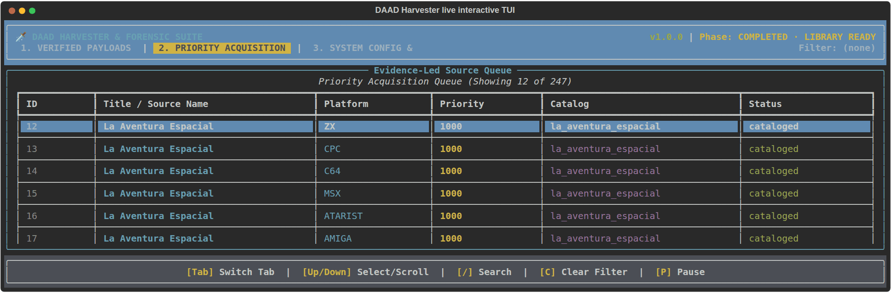

# DAAD Harvester

**DAAD Harvester** is an evidence-led preservation pipeline for public artifacts created with **DAAD** (*Diseñador de Aventuras AD*). It is designed for the whole official DAAD target family—not one archive, one media type, or one computer. DAAD maintained a common adventure source model across ZX Spectrum, Amstrad CPC, Commodore 64, Commodore Plus/4, MSX, Amstrad PCW, Atari ST, Amiga, and IBM PC/DOS.[1] [2]

The project exists because preservation evidence is fragmented. A title can have several platform releases, master-disk revisions, repacks, loaders, interpreters, data files, and archive descriptions that disagree with one another. A result page is not a download; a game title is not a binary version; and an interpreter filename is not a verified database. DAAD Harvester preserves those distinctions from discovery through library organization.

> **Trust boundary:** Source and catalog records establish what a publisher, archive, or community database claims. A local artifact is verified as DAAD only when its database structure passes target-aware validation. An exact interpreter identity requires a same-platform SHA-256 match against a registered official runtime profile.



*This GIF is a reproducible recording of the production TUI against a retained real acquisition run. It shows the artifact-evidence ledger, selection movement, artifact inspector, theme cycle, search/filter clearing, priority queue, system metrics, and pause state. Its visible `0 Verified DDBs` count is intentional: the recording does not fabricate a binary verification result when the selected audit state contains none.*

The implementation notes, format boundaries, version chronology, derivative taxonomy, source register, TUI capture method, and Pages contract are modularized under [`docs/`](docs/README.md). The public static report is published at [boolforge.github.io/DAAD-harvester](https://boolforge.github.io/DAAD-harvester/).

> **SELF-CONTAINED REGENERATION: REQUIRED.** Every promoted result must be reproducible from committed inputs, repository code, declared dependencies, and a documented network-free command. VICE, Ghidra, radare2, browser sessions, archive services, and other external applications may provide independent corroboration or acquisition-time observations, but never a hidden primary prerequisite. The complete mandatory policy, manifest contract, and CI gate are documented in [`docs/SELF_CONTAINED_REGENERATION.md`](docs/SELF_CONTAINED_REGENERATION.md).

## The preservation model

A reliable preservation tool should not turn every web page into a download job. DAAD Harvester separates release evidence, artifact acquisition, media extraction, database verification, runtime identification, and library materialization.

| Question | Evidence required | What the pipeline records |
| --- | --- | --- |
| Is this a DAAD-associated title or release? | A conservative catalog match or a source page with explicit DAAD/platform evidence. | `known_game_id`, source name, role, record URL, release ID, release revision, and source provenance JSON. |
| Is this source fetchable without bypassing controls? | A direct binary URL that succeeds under the source contract. | A `pending` source. Catalog pages and blocked endpoints are retained as `cataloged`, not queued. |
| What media is present? | A downloaded container or disk image parsed locally. | Original and extracted members, depth, hashes, native container format, and member provenance. |
| Is a member a DAAD database? | Header, target, declared length, offsets, process references, and bounded DAAD bytecode validation. | Measured platform, DDB layout/version, language, confidence, and structural evidence. |
| Which runtime is bundled? | Exact SHA-256 profile match, or a qualified platform-specific runtime filename. | Interpreter identity, version when available, language, SHA-256, and confidence. |

The result is an auditable SQLite state database and a classified library, rather than a speculative collection of links.

## Official target coverage

The table below describes what the current pipeline implements. **Direct media** means the adapter can place a validated direct-file candidate into the queue. **Catalog evidence** means the site is retained for platform/release provenance without pretending that a page or access-controlled endpoint can be fetched unattended.

| DAAD target | Native media and extraction | Platform-specific discovery and provenance | Structural database verification | Library folder |
| --- | --- | --- | --- | --- |
| **ZX Spectrum** | TAP plus typed TZX/CDT v1.20 block validation; recursive archives; snapshot evidence is retained but not promoted. | ZXDB/ZXInfo, World of Spectrum, Spectrum Computing paths, Internet Archive metadata, Computer Emuzone catalog evidence. | Modern DRC V2/V3 and compact historical V1/V2 DDB layouts. | `library/ZX/` |
| **Amstrad CPC** | Structural standard/extended DSK validation, CP/M extraction, and typed CDT/TZX tape validation. | Internet Archive CPC metadata, WikiCAAD evidence, Computer Emuzone catalog evidence. | Modern DRC V2/V3 and compact historical V1/V2 DDB layouts. | `library/CPC/` |
| **Commodore 64** | D64/D71, T64, PRG, P00, CBM TAP, and G64 structural evidence; recursive archives. | CSDb metadata, Internet Archive C64 records, Computer Emuzone catalog evidence. | Modern DRC V2/V3 and compact historical V1/V2 DDB layouts. | `library/C64/` |
| **Commodore Plus/4 / C16 64K** | D64/D71, T64, PRG, P00, and CBM TAP structural evidence; recursive archives. | Plus/4 World direct media and release catalog records; Computer Emuzone catalog evidence. | Modern DRC V2/V3 and compact historical V1/V2 DDB layouts. | `library/PLUS4/` |
| **MSX** | FAT12/FAT16 media, CAS, and conservative `AB` cartridge-header evidence without unproven mapper labels. | Generation MSX release catalog, Computer Emuzone catalog evidence, and public multi-platform release evidence. | Modern DRC V2/V3 and compact historical V1/V2 DDB layouts. | `library/MSX/` |
| **Amstrad PCW** | CP/M-compatible FAT12/FAT16 paths and typed tape-block evidence where media is shared. | Computer Emuzone platform/release catalog evidence and cross-platform archive metadata. | Modern DRC V2/V3 and compact historical V1/V2 DDB layouts. | `library/PCW/` |
| **Atari ST** | ST/MSA and FAT12/FAT16 media; STX/Pasti and SPS/IPF preservation-container evidence. | Verified Atarimania DAAD record pages, Computer Emuzone catalog evidence, and Internet Archive metadata. | Modern DRC V2/V3 and compact historical V1/V2 DDB layouts. | `library/ATARIST/` |
| **Amiga** | ADF, ADZ, DMS with validated NOCOMP/SIMPLE/QUICK/MEDIUM/DEEP/HEAVY decoding, and extension-block-aware OFS/FFS extraction. | Internet Archive Amiga media, Aminet runtime/tool provenance, Computer Emuzone catalog evidence. | Modern DRC V2/V3 and compact historical V1/V2 DDB layouts. | `library/AMIGA/` |
| **IBM PC / DOS** | FAT12/FAT16 filesystem walking, COM/EXE handling, and structural MZ executable evidence. | Computer Emuzone release catalog evidence, Internet Archive metadata, and public multi-platform release pages. | Modern DRC V2/V3 and compact historical V1/V2 DDB layouts. | `library/DOS/` |

DAAD’s official repository and the contemporary DAAD V2 release documentation identify this target family.[1] [2] A platform field is normalized from source evidence; a generic `.dsk`, `.prg`, or `.zip` suffix is never treated as platform proof by itself.

## Version-aware, interpreter-aware fingerprinting

The fingerprint phase is deliberately more demanding than a text or magic-byte scan. It treats database detection and runtime identification as different claims.

| Evidence layer | What is validated | Resulting metadata | Confidence |
| --- | --- | --- | --- |
| **Modern DRC DDB** | Target byte, base address and endianness, declared length, header offsets, process table, referenced entries, and non-empty `0xFF`-terminated condact streams. | `ddb_format=daad-v2` or `daad-v3`, DDB major version, measured target and language. | `verified` |
| **Historical DAAD DDB** | Compact interpreter-defined V1/V2 header: version, packed target/language, mandatory `0x5F` marker, file-relative offsets, declared size, process references, and terminated condact streams. | `ddb_format=daad-v1-legacy` or `daad-v2-legacy`, measured target and language. | `verified` |
| **Embedded DDB** | The same structural rules applied at a bounded embedded offset, with exact declared payload length. | Embedded offset and structural details in artifact evidence. | `verified` |
| **Official interpreter binary** | SHA-256 equality with a registered same-platform official runtime profile. | `interpreter_identity`, language, hash, and any known runtime version. | `verified` |
| **Qualified runtime filename** | A platform-specific interpreter filename in a retained bundle, without an exact profile hash. | Interpreter identity and hash, but no invented product version. | `strong` |

The compact historical layout is derived from the open-source **MSX2DAAD** interpreter’s `DDB_Header` and loader contract. Its header explicitly distinguishes V1, V2, and V3 behavior; V3-capable builds auto-detect V3 databases while preserving V2 compatibility.[3] The harvester does **not** infer a compiler version from a title, release date, file extension, or arbitrary `DAAD` string.

A real Plus/4 audit artifact named `EDIPLUS4` demonstrated the intended distinction: it was not promoted to a DDB merely because of its name, but its SHA-256 exactly matched the registered official Plus/4 interpreter profile and was recorded as a **verified runtime identity**.

## Platform-specific source contracts

Every adapter is constrained by a source contract. A blocked, login-bound, temporary, or HTML-only endpoint is useful provenance but not a valid unattended download source.

| Source | Coverage and role | Queue behavior |
| --- | --- | --- |
| [Internet Archive][4] | Cross-platform archive metadata and direct media, including CPC, C64, Amiga, DOS, and platform-tagged collections. | Direct compatible files are queued only after item metadata is checked. |
| [ZXDB / ZXInfo][5] and [World of Spectrum][6] | Spectrum release evidence and compatible public media paths. | Direct compatible tape/disk/archive paths may be queued; snapshots and unsupported engines are rejected. |
| [Plus/4 World][7] | Plus/4/C16 release catalog and public direct media. | Direct program and archive media may be queued; catalog pages remain evidence records. |
| [CSDb][8] | C64 release catalog and metadata. | Catalog evidence is retained; only explicit direct media is eligible for the queue. |
| [Generation MSX][9] | MSX release and publisher catalog evidence. | Catalog-only unless a separate verified direct-media contract exists. |
| [Atarimania][10] | Bounded, independently indexed Atari ST DAAD record pages, rechecked for DAAD text. | Catalog-only release evidence. |
| [Aminet][11] | Amiga interpreter and tool-distribution provenance. | Tool evidence is cataloged separately from game media. |
| [Computer Emuzone][12] | Per-platform DAAD title/release evidence across the target family. | Catalog-only. Its public engine index is readable, but live validation found its `download.php?ind=` endpoints return HTTP 403 to unattended clients even with browser-compatible headers; they are never queued. |
| itch.io, WikiCAAD, CASA, GitHub, IFDB, and targeted web results | Release/catalog evidence, project archives, and conservative opportunistic discovery. | A web page, payment gate, temporary link, or generic search result is never assumed to be a binary. |

This approach deliberately prefers **zero downloads** over a queue of guessed URLs. It also makes a source-access failure a durable, reviewable result instead of an invisible retry loop.

## Install

Python **3.10+** and Git are required. Choose one installation line for your environment.

| Environment | One-line installation |
| --- | --- |
| Linux or macOS | `python3 -m pip install --user --upgrade "git+https://github.com/boolforge/DAAD-harvester.git"` |
| Debian / Ubuntu with common archive tools | `sudo apt-get update && sudo apt-get install -y python3-pip git 7zip unzip unar libarchive-tools unrar-free cabextract arj lhasa && python3 -m pip install --user --upgrade "git+https://github.com/boolforge/DAAD-harvester.git"` |
| macOS with Homebrew | `brew install python git p7zip unar unrar cabextract arj lhasa && python3 -m pip install --user --upgrade "git+https://github.com/boolforge/DAAD-harvester.git"` |
| Windows PowerShell | `py -m pip install --user --upgrade "git+https://github.com/boolforge/DAAD-harvester.git"` |
| Android Termux | `pkg update -y && pkg upgrade -y && pkg install -y python git clang make pkg-config libffi && python -m pip install --upgrade pip setuptools wheel && python -m pip install "git+https://github.com/boolforge/DAAD-harvester.git"` |

For development:

```bash
git clone https://github.com/boolforge/DAAD-harvester.git
cd DAAD-harvester
python3 -m venv .venv
source .venv/bin/activate
python -m pip install --upgrade pip
python -m pip install -e ".[dev]"

daad-harvester --version
daad-harvester --help
```

### Android Termux

[Termux][13] provides an Android terminal with package management and Python support. After installation, run the one-line command above. To make output visible to Android file managers, grant shared storage once and use a dedicated output folder.

```bash
termux-setup-storage
daad-harvester --version
daad-harvester --phase discover --output-dir ~/storage/shared/DAAD-Harvester
```

The core pipeline works without the TUI. A Bluetooth keyboard and wide terminal are helpful for the optional interactive dashboard. Optional extractor packages vary by device architecture; install only packages available in your configured Termux repositories after the base install succeeds.

## Recommended workflow

Use an output directory that is **not** committed to Git. It can contain downloaded copyrighted material, logs, and your local SQLite state.

```bash
# 1. Discover current source and catalog evidence; nothing is downloaded.
daad-harvester --phase discover --output-dir ./output
daad-harvester --phase catalog --output-dir ./output

# 2. Inspect the evidence and acquire a deliberately bounded first batch.
less ./output/evidence_catalog.json
daad-harvester --phase fetch --parallel 2 --max-sources 6 --output-dir ./output

# 3. Extract native media, fingerprint payloads, synthesize outputs, organize, and export the static report contract.
daad-harvester --phase unpack --parallel 2 --output-dir ./output
daad-harvester --phase fingerprint --output-dir ./output
daad-harvester --phase synthesize --output-dir ./output
daad-harvester --phase organize --output-dir ./output
daad-harvester --phase report --output-dir ./output
```

Run the full workflow only after reviewing the source queue and selecting an appropriate rate:

```bash
daad-harvester --phase all --parallel 2 --output-dir ./output
```

| Phase | Purpose | Important behavior |
| --- | --- | --- |
| `discover` | Gather platform-aware source and catalog records. | Does not download. Catalog-only sources are preserved but never placed in the pending queue. |
| `catalog` | Export the evidence catalog. | Publishes source claims separately from binary measurements. |
| `fetch` | Acquire pending direct artifacts. | Rejects empty bodies and HTML/JSON responses; records HTTP status and content type. |
| `unpack` | Expand archives, disk images, tapes, and native containers. | Retains container/member provenance and bounded recursive extraction. |
| `fingerprint` | Verify DDBs and identify adjacent runtimes. | Does not convert title or filename evidence into a binary claim. |
| `synthesize` | Build deterministic output catalogs and reports. | Reuses persisted evidence; does not re-download. |
| `organize` | Create the ready-to-use classified library. | Uses platform/game folders and writes a provenance manifest. |
| `report` | Export browser-safe static report data. | Omits local extraction paths; joins evidence catalog, detection metadata, library manifest, and bounded log tails. |
| `all` | Run the complete ordered pipeline. | Executes `discover → catalog → fetch → unpack → fingerprint → synthesize → organize → report`. |

Launch the real TUI with a terminal:

```bash
daad-harvester --phase fetch --max-sources 6 --parallel 2 --tui --output-dir ./output
```

The documentation animation can be reproduced only from a real completed state database:

```bash
python scripts/capture_tui_demo_gif.py \
  --db ./output/state.db \
  --output ./docs/assets/tui-live-demo.gif
```

## Outputs and classified library

| Output | Meaning |
| --- | --- |
| `state.db` | Resumable SQLite state for sources, artifacts, binary measurements, and version evidence. |
| `evidence_catalog.json` | Reviewable known-title, source, platform, release, toolchain, and artifact evidence. |
| `downloads/` | Bytes accepted by the fetcher after response validation. |
| `extracted/` | Original and recursively extracted artifact bytes. |
| `daad_catalog.json` | Synthesized catalog of binary-verified DAAD payloads. |
| `detection_tables.h` | Candidate detection entries generated from verified payloads. |
| `report.md` | Human-readable report from persisted state. |
| `report_data.json` | Browser-safe static report contract for the evidence viewer; local extraction paths are excluded. |
| `library/` | Classified platform/game folders. Direct runnable disk, tape, executable, ROM, and program-image media is placed under `ready_to_use/`; archives and uncertain/supporting material are retained separately. |
| `library/manifest.json` | Original path, source URL, hashes, source/platform evidence, classification, and materialization method for every library member. |
| `logs/` | Discovery, download, unpacking, error, and game-identification logs. |

A library path is a convenience classification, not an emulation claim. The pipeline preserves support files and unrecognized members because they can be crucial to later forensic work.

## Validation status and limits

The implementation is tested with deterministic modern DRC V2/V3 and historical V1/V2 DDB fixtures across all **nine** canonical targets, negative controls, embedded-payload recovery, official interpreter-profile tests, source-adapter tests, all-mode DMS fixtures, typed tape-block fixtures, FAT12/FAT16 traversal, native-media corruption boundaries, and two hash-pinned repository-native regeneration paths. The current suite contains **237 passing tests**.

A fresh isolated public-source audit produced **174** source records. Its deliberately bounded six-source acquisition accepted **five** public downloads and retained **37** extracted/measured artifacts from Spectrum and Commodore/Plus/4 media. No member passed the structural DDB contract, so the run records **zero verified DDBs** rather than inventing a DAAD version. The full command sequence, counts, and source-failure boundary are recorded in [`docs/audits/2026-08-19_FINAL_LIVE_AUDIT.md`](docs/audits/2026-08-19_FINAL_LIVE_AUDIT.md). An earlier retained sample also contained the exact Plus/4 `EDIPLUS4` runtime match described above.

> A cataloged title, a direct platform release, an extracted interpreter, and a verified DDB are intentionally different states. If a historical multi-part layout has not yielded a structurally verified database, DAAD Harvester records the evidence and does not fabricate a version label.

Run the deterministic checks locally after changes:

```bash
python -m pytest
python -m pyflakes daad_harvester/daad_parser.py daad_harvester/fingerprint.py
```

## Troubleshooting

| Symptom | Cause | Correct response |
| --- | --- | --- |
| A source creates no pending download. | It is catalog-only, blocked, gated, or has no validated direct-file contract. | Preserve the evidence record; do not add the page URL as a binary seed. |
| A generic disk image has no inferred platform. | `.dsk` and similar extensions are ambiguous. | Add source or archive metadata; never classify purely from the suffix. |
| A known title has no DAAD version. | Title/release evidence is not a measured database. | Fetch, unpack, and fingerprint the platform artifact. |
| A runtime is recorded but no DDB is verified. | Interpreters, loaders, and database files are distinct. | Keep the runtime identity and provenance; do not promote it to a game payload. |
| A response is rejected as HTML or JSON. | The URL resolved to a page, error, login, or purchase flow. | Treat the rejection as successful protection and inspect the adapter contract. |
| A file remains under `support_or_unknown/`. | It is auxiliary, archived, or not yet recognized as direct runnable media. | Preserve it; later format work can use its hash and provenance. |

## Responsible use

Use public sources respectfully. Follow source terms, robots policies, and rate limits. Do not bypass authentication, payment, regional restrictions, CAPTCHAs, or access controls. Keep source URLs, response details, hashes, and evidence records with any preservation research.

## License

This repository is licensed under the MIT License. See [LICENSE](LICENSE).

## References

[1]: https://github.com/daad-adventure-writer/daad "DAAD Adventure Writer"
[2]: https://www.msx.org/news/en/multi-platform-daad-adventure-writer-v2-r2-released "Multi-platform DAAD Adventure Writer V2 R2 released"
[3]: https://github.com/nataliapc/msx2daad "MSX2DAAD interpreter"
[4]: https://archive.org/ "Internet Archive"
[5]: https://api.zxinfo.dk/v3/ "ZXInfo API v3"
[6]: https://worldofspectrum.org/ "World of Spectrum"
[7]: https://plus4world.powweb.com/ "Plus/4 World"
[8]: https://csdb.dk/ "Commodore Scene Database"
[9]: https://www.generation-msx.nl/ "Generation MSX"
[10]: https://www.atarimania.com/ "Atarimania"
[11]: https://aminet.net/ "Aminet"
[12]: https://computeremuzone.com/engine/daad?l=en "Computer Emuzone DAAD catalog"
[13]: https://termux.dev/en/ "Termux"
