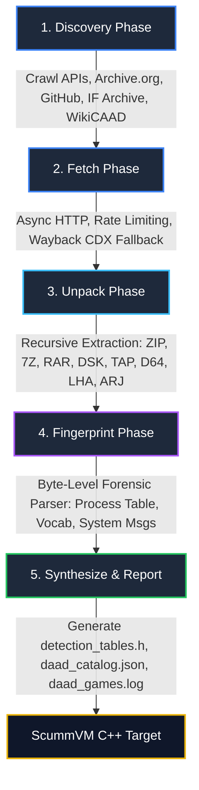

# 🗡️ DAAD Harvester

[](https://www.python.org/downloads/)
[](https://www.scummvm.org/)
[](LICENSE)
[](#)

A high-performance, resilient ETL pipeline and forensic analysis tool designed for discovering, downloading, recursively unpacking, fingerprinting, and synthesizing ScummVM detection tables for **DAAD (Designed Action Artwork System)** adventure game artifacts across retro-computing archives.

---

## 📖 Overview & Historical Context

### What is DAAD?
Created in the late 1980s by Tim Gilberts for Spanish game developer **Aventuras AD**, the **Designed Action Artwork System (DAAD)** was a state-of-the-art text adventure authoring system and virtual machine. Successor to *The Quill* and *PAWS*, DAAD allowed authors to write a single adventure game source file and target multiple 8-bit and 16-bit platforms:

- **Sinclair ZX Spectrum** (48K / 128K)
- **Amstrad CPC**
- **Commodore 64**
- **Amiga**
- **Atari ST**
- **MS-DOS / IBM PC**
- **MSX / MSX2**
- **Oric / Atmos**

DAAD powered classic Spanish graphic adventure software (*La Aventura Original*, *El Jabato*, *La Diosa de Cozumel*, *Los Templarios*, *Chichén Itzá*), and continues to see active homebrew development today via modern tools like *DAAD Ready*.

---

## 📊 Live Interactive TUI Dashboard Showcase

Launch the harvester with `--tui` to display a real-time interactive Rich dashboard showing live ETL counters, domain status, and identified DAAD game payloads:

```text
╭──────────────────────────────────────────────────────────────────────────────────────────────────╮
│ DAAD ENGINE HARVESTER & FORENSIC SUITE                               v1.0.0 | ETL Status: ACTIVE │
╰──────────────────────────────────────────────────────────────────────────────────────────────────╯
╭──────────────── System Config ─────────────────╮╭────────────── Metrics & Counters ──────────────╮
│             Configuration Settings             ││              Live ETL Statistics               │
│  Output Directory          ./output            ││  Total Discovered Sources                 184  │
│  Database Path             ./output/state.db   ││  Downloaded Sources                       128  │
│  Parallel Workers          8                   ││  Extracted Artifacts                      412  │
│  Rate Limit / Domain       1.0 req/s           ││  Verified DAAD Payloads                    24  │
│  Max Unpack Depth          5                   ││  ScummVM Catalog Entries                   24  │
│  Proxies Loaded            0                   ││  Elapsed Time                           12.4s  │
╰────────────────────────────────────────────────╯╰────────────────────────────────────────────────╯
╭──────────────────────────────────── DAAD Games Forensic Feed ────────────────────────────────────╮
│                                   Discovered DAAD Games (Live)                                   │
│ ┏━━━━┳━━━━━━━━━━━━━━━━━━━━━━━┳━━━━━━━━━━┳━━━━━━━━━━━━━━━━━┳━━━━━━━━━━━━━━━━━━━━━┳──────────────┓ │
│ ┃ ID ┃ Title                 ┃ Platform ┃ Engine Version  ┃ MD5 Hash            ┃         Size ┃ │
│ ┡━━━━╇━━━━━━━━━━━━━━━━━━━━━━━╇━━━━━━━━━━╇━━━━━━━━━━━━━━━━━╇━━━━━━━━━━━━━━━━━━━━━╇━━━━━━━━━━━━━━┩ │
│ │ 1  │ La Aventura Original  │ DOS      │ DAAD DDB        │ a1b2c3d4e5f67890... │     142.5 KB │ │
│ │ 2  │ El Jabato             │ ZX       │ DAAD DDB        │ 8f7e6d5c4b3a2109... │      48.0 KB │ │
│ │ 3  │ La Diosa de Cozumel   │ AMIGA    │ DAAD DDB        │ 1234567890abcdef... │     720.0 KB │ │
│ └────┴───────────────────────┴──────────┴─────────────────┴─────────────────────┴──────────────┘ │
╰──────────────────────────────────────────────────────────────────────────────────────────────────╯
```

---

## 🏗️ Architecture & Pipeline Design

DAAD Harvester operates as an idempotent, 5-stage ETL pipeline backed by a local SQLite state database (`state.db`) for full resumability.



### Key Pipeline Stages

1. **Discovery (`daad_harvester.discover`)**: Crawls high-yield retro archives (Internet Archive, GitHub DAAD Ready repos, IF Archive, WikiCAAD, Aminet, IFDB, ZXDB, Spectrum Computing) using strict filters to eliminate non-game software.
2. **Fetch (`daad_harvester.fetch`)**: Asynchronous downloader with per-domain rate limiting, user-agent randomization, proxy rotation, and Wayback Machine CDX API fallback for broken links.
3. **Unpack (`daad_harvester.unpack`)**: Multi-layer recursive container extraction (ZIP, 7Z, RAR, DSK disk images, TAP/TZX tape dumps, D64, ARJ, LHA, CAB, TAR) with zip-bomb protection.
4. **Fingerprint (`daad_harvester.fingerprint`)**: Deep binary inspection checking 16-bit process table offset pointers (Proceso 0, 1, 2), DAAD vocabulary tokens, and system strings while rejecting non-DAAD binaries.
5. **Synthesize & Report (`daad_harvester.synthesize`)**: Generates ScummVM C++ `ADGameDescription` entries (`detection_tables.h`), JSON catalogs (`daad_catalog.json`), and structured real-time discovery logs (`daad_games.log`).

---

## 🛠️ System Requirements & Installation

### Prerequisites
- **Python 3.10+**
- Recommended system archive extraction tools for maximum multi-format support:

#### Ubuntu / Debian:
```bash
sudo apt-get update && sudo apt-get install -y p7zip-full unzip unar libarchive-tools unrar cabextract arj lhasa 7zip
```

#### macOS (Homebrew):
```bash
brew install p7zip unzip unar libarchive unrar cabextract arj lhasa 7zip
```

### Installation
Clone the repository and install required dependencies:
```bash
git clone https://github.com/boolforge/daad-harvester.git
cd daad-harvester
pip install -r requirements.txt
```

---

## 🚀 Usage Guide

### Run Full Harvester Pipeline with Live TUI
```bash
python3 -m daad_harvester --tui --output-dir ./output
```

### Run Specific Phase
```bash
# Run discovery phase only
python3 -m daad_harvester --phase discover --output-dir ./output

# Run download phase only with 8 parallel workers
python3 -m daad_harvester --phase fetch --parallel 8 --output-dir ./output

# Run recursive unpacking phase
python3 -m daad_harvester --phase unpack --output-dir ./output

# Run byte-level fingerprinting
python3 -m daad_harvester --phase fingerprint --output-dir ./output

# Generate ScummVM C++ detection tables & report
python3 -m daad_harvester --phase synthesize --output-dir ./output
```

---

## 📋 CLI Reference Options

```
options:
  -h, --help            Show this help message and exit
  --phase {discover,fetch,unpack,fingerprint,synthesize,all}
                        Pipeline phase to execute (default: all)
  --resume              Resume pipeline using existing state database
  --parallel PARALLEL   Number of parallel download workers (default: 8)
  --output-dir OUTPUT_DIR
                        Output directory for catalog and reports (default: ./output)
  --proxy-list PROXY_LIST
                        Path to proxy list text file
  --log-file LOG_FILE   Path to log file (default: ./daad-harvester.log)
  --log-level LOG_LEVEL Log level (default: INFO)
  --tui                 Launch live interactive TUI dashboard display
  --version             Show program version number
```

---

## 🪵 Log Management & History Preservation

To ensure historical execution logs are never lost:
- When starting a run, any existing `daad-harvester.log` or `daad_games.log` files are automatically renamed with a timestamp backup (e.g., `daad_games_20260817_120000.log`).
- Verified DAAD games are appended immediately to `daad_games.log` during the fingerprinting phase in real-time, recording title, platform, engine version, source URL, extracted path, and multi-algorithm cryptographic hashes (`MD5`, `SHA-256`, `SHA-1`, `CRC32`, `XXH64`).

---

## 🧪 Testing

Run unit and integration tests using `pytest`:
```bash
PYTHONPATH=. python3 -m pytest tests/
```

---

## 📄 License

This project is licensed under the MIT License - see the `LICENSE` file for details.
