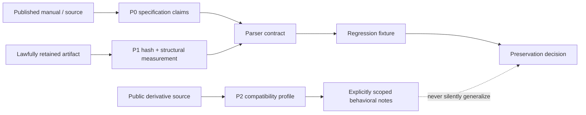

# DAAD Preservation Research Methodology

## Purpose and scope

This corpus is intended as an engineering reference for **digital preservation**, **software archaeology**, and future clean-room interpreter work. It documents DAAD-family artifacts as evidence-bearing objects: a source release, a compiler output, an interpreter binary, a disk or tape image, and a game title are related but not interchangeable claims.

> **Methodological rule:** The documentation must preserve uncertainty. When a behavior is known only from a derivative, a public manual, or a measured binary, the document names that boundary. It never converts a plausible historical narrative into a format fact.

The official DAAD repository says that DAAD was contributed to the public domain, but also states that original interpreter sources are not currently supplied.[1] Consequently, this project documents published manuals, public source releases, released media, measured structures, and lawfully obtained checksums. It does not redistribute proprietary interpreter code, publish decompiled proprietary routines, or present a derivative implementation as proof of undocumented original behavior.

## Evidence ladder

| Grade | Permitted basis | Typical claim | Documentation language |
| --- | --- | --- | --- |
| **P0 — primary source** | Official source release, specification, manual, release manifest, or legal notice. | A field is defined or a tool declares support. | “The source/manual specifies …” |
| **P1 — reproducible structural measurement** | Immutable artifact, SHA-256, byte offsets, parser trace, and repeatable test. | A particular artifact contains a validated DDB/header/container. | “The measured artifact at hash … contains …” |
| **P2 — independent open implementation** | Public derivative source with repository revision and tests. | MSX2DAAD implements a stated compatibility behavior. | “MSX2DAAD implements …; this is not generalized to all original interpreters.” |
| **P3 — secondary historical evidence** | Credible archive catalog, technical article, museum record, or documented oral history. | A release is attributed to a platform or date. | “The cited catalog reports …” |
| **P4 — hypothesis** | Pattern resemblance or incomplete binary observation. | A possible layout family or loader relation. | “Hypothesis; not used for automated verification.” |

An automated Harvester decision may use P0/P1 directly. P2 may inform a **separately labeled compatibility profile**. P3 can seed catalog provenance but cannot establish binary identity. P4 is retained only in archaeology notes and never promotes an artifact.

## Lawful reverse-engineering boundary

The project uses a layered approach that avoids treating proprietary binaries as decompilation targets for redistribution.

The permissible workflow is to record container boundaries, checksum rules, machine-visible headers, bytecode tables published in manuals, and externally observable behavior from a lawfully retained artifact. A clean-room implementation must be written from those records and independently tested. The original binary is neither copied into source nor used as a hidden implementation oracle when its rights status is unclear.

## Documentation anatomy

Every detailed module must contain the following sections where applicable.

| Section | Required content |
| --- | --- |
| **Status and evidence scope** | P0–P4 classification, revision/date, and a statement of what the document does not prove. |
| **Artifact model** | Names, magic values, byte order, sizes, alignment, ownership of each field, and cross-platform ambiguity. |
| **Schematic** | A byte layout, state machine, media topology, or provenance flowchart rendered as Mermaid or a text table. |
| **Validation algorithm** | Ordered checks, bounds, checksum/CRC policy, error states, and no-partial-output conditions. |
| **Implementation mapping** | Harvester modules, persisted evidence fields, test fixtures, and known divergence from the required ideal. |
| **Forensic workflow** | Acquisition boundary, hashing, safe extraction, structural measurement, provenance recording, and reproducibility commands. |
| **References** | Stable URL, repository revision or retrieval date where available, source grade, and the exact claim it supports. |

## Module map

| Documentation family | Detailed modules to maintain | Primary purpose |
| --- | --- | --- |
| `versions/` | Chronology, DDB layout generations, condact/bytecode semantics, release-to-evidence matrix. | Separate DAAD product labels from measured DDB versions. |
| `interpreters/` | Identity protocol, official profile ledger, platform runtime loading model, derivative implementation boundaries. | Explain hashes, loaders, and compatibility without filename inference. |
| `formats/` | Tape streams, disk/container media, filesystems, archive wrappers, executable/snapshot evidence. | Define safe parser and preservation contracts. |
| `platforms/` | One dossier per canonical DAAD target. | Connect runtime, media, loader conventions, and provenance by machine. |
| `derivatives/` | DRC, DAAD Ready!, Maluva, MSX2DAAD, PCDAAD, UnDAAD, and other evidence-backed projects. | Describe compatibility and departure separately. |
| `sources/` | Primary source ledger, source-adapter register, reproducible artifact manifest policy. | Make every external claim traceable. |
| `audits/` | Dated reproducible runs and negative results. | Preserve changing live-source behavior without rewriting history. |

## Reproducibility packet

For a future artifact study, retain a minimal packet containing the original acquisition URL and timestamp, legal/access status, response metadata, immutable SHA-256, parent-container hash, extraction path expressed as member lineage rather than local filesystem path, parser decision, all parser warnings, measured DDB/interpreter evidence, and the exact Harvester revision and test fixture used. This packet permits independent reanalysis even if a public mirror later disappears.

## References

[1]: https://github.com/daad-adventure-writer/daad "Official DAAD repository: legal notice and release distribution"
[2]: https://github.com/nataliapc/msx2daad "MSX2DAAD public source repository"
