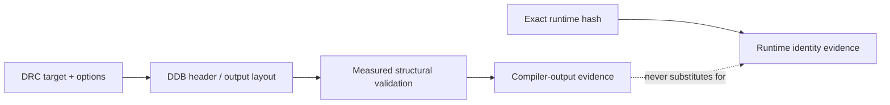

# DRC: Compiler Replacement and DDB Output Contract

| Header field | Value |
| --- | --- |
| **Question** | What does the public DRC project state and encode about compiled DAAD output? |
| **Evidence scope** | P0 public source and license; P1 reading of the retained `drb.php` revision `e7bb170`. |
| **Status** | source-backed |
| **Implementation links** | [`../../daad_harvester/fingerprint.py`](../../daad_harvester/fingerprint.py), [`../versions/DDB_GENERATIONS.md`](../versions/DDB_GENERATIONS.md), [`../interpreters/PUBLIC_IMPLEMENTATIONS.md`](../interpreters/PUBLIC_IMPLEMENTATIONS.md) |
| **Non-claims** | DRC output is not proof of an original historical interpreter, nor does a DRC machine ID prove that every runtime accepts every emitted feature. |

## Project role

DRC is a GPL-3.0 public compiler replacement in the DAAD ecosystem. Its retained source revision `e7bb170` exposes target selection, DDB header construction, optional wrappers, and target-default addressing. It is therefore direct evidence about **that compiler’s output contract**, rather than proprietary-interpreter behavior.[1]

> The preservation question is not “is this DAAD?” but “which compiler contract is evidenced by this byte sequence, and which other evidence is needed before asserting runtime identity?”

## Target and machine-family evidence

DRC’s command syntax declares the targets `ZX81`, `CPM`, `HTML`, `ZX`, `CPC`, `C64`, `PCW`, `MSX`, `AMIGA`, `PC`, `ST`, `MSX2`, and `CP4`. The public source assigns a machine ID to the emitted DDB header; the canonical table belongs in the DDB-generation module to avoid repeating a byte schema here.[2]

| DRC concept | Preservation meaning | Report treatment |
| --- | --- | --- |
| Target | Requested output family such as ZX, CPC, C64, CP4, MSX, PCW, PC, ST, or Amiga. | Record as compiler-output evidence when header parsing succeeds. |
| Subtarget | Target-specific selection, such as PC VGA variants or MSX2 display/character settings. | Record only if artifact provenance or an emitted structural feature actually retains it. |
| Machine ID | DRC header discriminator emitted by `getMachineIDByTarget()`. | Corroborates a DRC-style output interpretation; it is not an interpreter hash. |
| Forced base address | Explicit compiler override in the source model. | Prevent a default-address assumption when the artifact provides a measurable alternative. |

## Output boundaries that matter to Harvester

The local source exposes target defaults through `getBaseAddressByTarget()`, identifies padding platforms, and treats Atari ST and Amiga as little-endian in that compiler’s output logic.[2] Harvester may validate a candidate DDB using measured fields consistent with this contract, but must preserve each decision as **structural DDB evidence**, not convert it into a historical-release assertion.

The same source supports optional Commodore and +3 headers (`-ch` and `-3h`) and output modifiers such as padding and a forced base address.[2] These are packaging/output choices. A wrapper’s presence does not identify the original game release, its distributor, or its executing binary.

## Harvester reporting contract

Harvester should emit a qualified statement such as: **“DDB structure is consistent with the documented DRC target contract: CPC”** only when the measured fields validate. It must attach the parsed fields, validation result, source revision, and neighboring bundle evidence separately. It must not report **“official CPC interpreter”**, **“historical DAAD release Rn”**, or **“fully playable”** from this compiler evidence alone.

## References

[1]: https://github.com/daad-adventure-writer/daad "Official DAAD/DRC public distribution"
[2]: https://github.com/daad-adventure-writer/daad/blob/e7bb170/src/drb.php "DRC `drb.php` target, machine-ID, and base-address logic"
