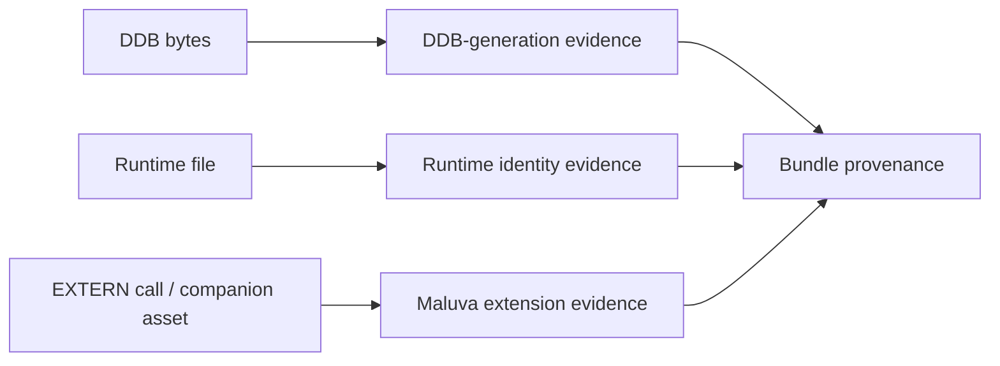

# Maluva: DAAD EXTERN Extension Boundary

| Header field | Value |
| --- | --- |
| **Question** | What public evidence distinguishes Maluva extension behavior from core DAAD/runtime identity? |
| **Evidence scope** | P0 public repository, README, license, and project history. |
| **Status** | source-backed |
| **Implementation links** | [`../../daad_harvester/unpack.py`](../../daad_harvester/unpack.py), [`../formats/EXECUTABLE_AND_SNAPSHOT_EVIDENCE.md`](../formats/EXECUTABLE_AND_SNAPSHOT_EVIDENCE.md), [`../platforms/AMIGA.md`](../platforms/AMIGA.md) |
| **Non-claims** | Maluva assets or calls do not identify an original DAAD interpreter, a DDB generation, or a working implementation on every listed target. |

## Project role

Maluva is an LGPL-3.0 public DAAD module described by its maintainers as an `EXTERN` extension. Its stated purpose is enabling DAAD games to use fast storage, including floppy disks, hard disks, SD media, cartridges, and related storage systems.[1]

## Target-support evidence

The repository’s public description lists ZX Spectrum, Amstrad CPC, Commodore 64, Amiga, Commodore Plus/4, MSX, PCW, and MS-DOS. This list is a **project-declared build/support scope**, not a guarantee that every release of Maluva or every feature works for every target.[1]

| Target family mentioned by project | Evidence status | Reporting rule |
| --- | --- | --- |
| ZX, CPC, C64, CP4, MSX, PCW, DOS | Listed in repository description; source/build files are publicly visible. | Report an extension candidate only with matching assets/calls and bundle provenance. |
| Amiga | Listed, but project history explicitly flags the Amiga target as not completed. | Do not report a working Amiga Maluva implementation without build-specific P1 evidence. |
| Other DAAD-related machines | Not established by this repository description. | Do not extrapolate support. |

## Evidence model for extension-aware artifacts

An artifact can carry a valid DDB, a distinct derivative runtime, and Maluva-associated companion resources at the same time. Harvester must preserve these as separate records rather than flattening them into a synthetic “Maluva DAAD version.”

## Preservation boundary

Maluva source is useful for a future compatibility implementation because it openly documents a project-specific extension layer. It must not be used to fill gaps in proprietary core-interpreter semantics, to declare an unknown runtime compatible, or to infer functionality on the explicitly incomplete Amiga path.

## References

[1]: https://github.com/Utodev/MALUVA "Maluva public repository and README"
