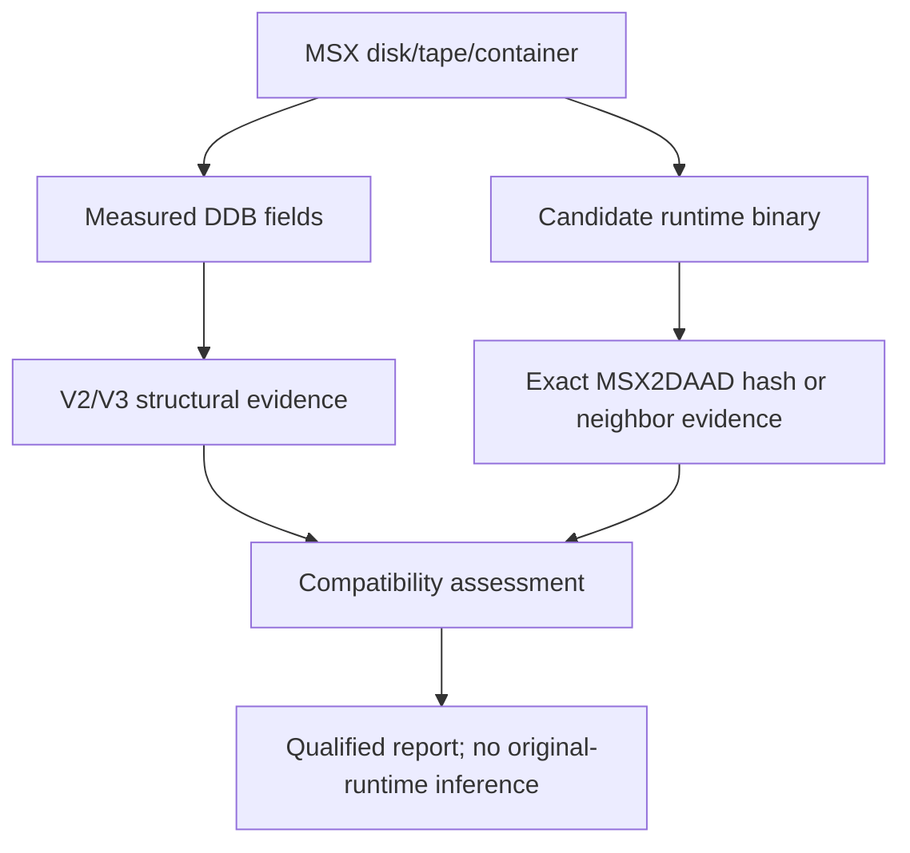

# MSX2DAAD: Public MSX2-Compatible Interpreter Scope

| Header field | Value |
| --- | --- |
| **Question** | What does the public MSX2DAAD project evidence about its own MSX2/MSX2+ runtime compatibility? |
| **Evidence scope** | P0 public source, license, and project documentation; P1 retained source inspection. |
| **Status** | source-backed |
| **Implementation links** | [`../../daad_harvester/interpreter_profiles.py`](../../daad_harvester/interpreter_profiles.py), [`../versions/COMPATIBILITY_BOUNDARIES.md`](../versions/COMPATIBILITY_BOUNDARIES.md), [`../platforms/MSX.md`](../platforms/MSX.md) |
| **Non-claims** | MSX2DAAD is not an original MSX interpreter binary, and its source behavior does not establish undocumented behavior of proprietary DAAD runtimes. |

## Project role

MSX2DAAD is a public, from-scratch interpreter project for MSX2/MSX2+ systems that uses the machines’ graphics capabilities. Its source is direct evidence for an independently implemented compatibility target, not for recovery of an unavailable original interpreter source.[1]

## Documented format scope

The project documentation and retained source identify V2 and V3 DDB handling as a compatibility objective. The implementation includes explicitly named V3 condacts and associated behavior; this establishes that its own behavior is version-aware, but does not turn every MSX DDB into a verified V2/V3 artifact.[1]

| Evidence item | What it can support | What it cannot support |
| --- | --- | --- |
| Exact MSX2DAAD file hash and bundle provenance | Identity of that captured public derivative build. | Identity of an original commercial MSX runtime. |
| Successful structural V2/V3 DDB validation | A qualified DDB-generation result. | Compatibility with every historical and derivative interpreter. |
| Project source behavior for a condact | A documented MSX2DAAD compatibility behavior. | Normative semantics for every DAAD release. |
| File name or MSX media location | Candidate/runtime-neighbor evidence. | Runtime identity or DDB generation by itself. |

## Runtime and DDB evidence separation

Harvester records three independently testable propositions: the DDB’s measured generation evidence; the exact interpreter file’s hash/provenance; and the bundle relation between them. The project’s source can enrich the second and third propositions only when the captured file is actually attributable to MSX2DAAD.[2]

## Preservation boundary

MSX2DAAD is suitable as a public implementation reference and, where the project’s own license permits, as a reproducible behavior test environment. It is not a substitute for archiving original runtime binaries with provenance, and it must not normalize a DDB before original bytes and measured structural fields have been retained.

## References

[1]: https://github.com/nataliapc/msx2daad "MSX2DAAD public repository"
[2]: https://github.com/nataliapc/msx2daad/tree/master/docs "MSX2DAAD documentation, including retained historical DAAD manual material"
