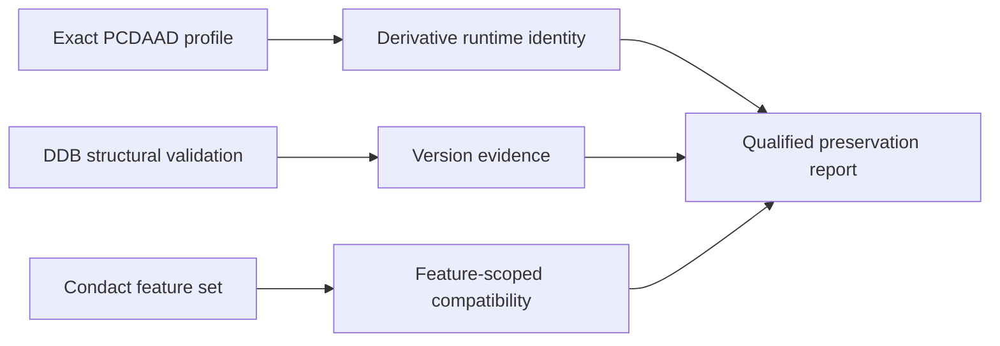

# PCDAAD: DOS VGA/SVGA Derivative Interpreter

| Header field | Value |
| --- | --- |
| **Question** | What compatibility behavior and divergence does the public PCDAAD project explicitly document? |
| **Evidence scope** | P0 public MIT-licensed source, README, and release metadata; P1 reproducible build/test work where retained. |
| **Status** | source-backed |
| **Implementation links** | [`../../daad_harvester/interpreter_profiles.py`](../../daad_harvester/interpreter_profiles.py), [`../platforms/IBM_PC_DOS.md`](../platforms/IBM_PC_DOS.md), [`../interpreters/IDENTITY_PROTOCOL.md`](../interpreters/IDENTITY_PROTOCOL.md) |
| **Non-claims** | PCDAAD is not behaviorally interchangeable with the original DOS interpreter, even when it can execute a DDB. |

## Project role and direct disclaimer

PCDAAD is a public MIT-licensed DOS interpreter project that uses VGA 320×200 256-color output and documents optional VESA/SVGA operation. Its README expressly says it does not attempt to support everything supported by original interpreters, while also noting that original interpreters did not all share the same features.[1]

> “PCDAAD does not pretend to support everything that was supported in the original interpreters.” — PCDAAD README.[1]

This is a decisive compatibility boundary: a successful PCDAAD execution is derivative-runtime evidence, **not** proof that an artifact is complete, authentic, or behaviorally equivalent under an original DOS runtime.

## Documented loading and language contract

The README states that PCDAAD loads `DAAD.DDB` from its folder by default, accepts a DDB argument, and uses the DDB header to detect English or Spanish. It also documents font, loading-screen, and numbered image companion-resource conventions.[1]

| Observed item | Valid report statement | Invalid shortcut |
| --- | --- | --- |
| `DAAD.DDB` near a PCDAAD executable | “Candidate PCDAAD bundle neighbor.” | “Official DOS interpreter bundle.” |
| Header language result | “PCDAAD’s documented language detection value.” | “Language provenance of the original release.” |
| `DAAD.FNT` / `DAAD.CHR` or PCX/VGA files | “Derivative companion-resource evidence.” | “Required original media set.” |
| Exact PCDAAD hash | “Identity of this public derivative binary.” | “Identity of a historical original runtime.” |

## Explicit feature differences

The maintained README records unsupported `CALL`, `GFX`, `SFX`, and `MOUSE` condacts, while also describing specific Maluva-related `EXTERN` behavior and a DRC `vga256` subtarget condition for certain extension calls.[1] These are feature-scoped facts. They must appear as negative/conditional compatibility evidence in reports instead of being concealed behind an undifferentiated “DAAD compatible” label.

## Preservation boundary

PCDAAD’s public source may be studied and reproducibly tested under its MIT license. Harvester should retain original DDB bytes and companion assets before test execution, record PCDAAD-specific behavior separately, and never replace an original runtime identity claim with a PCDAAD success/failure result.

## References

[1]: https://github.com/Utodev/PCDAAD "PCDAAD public repository and README"
