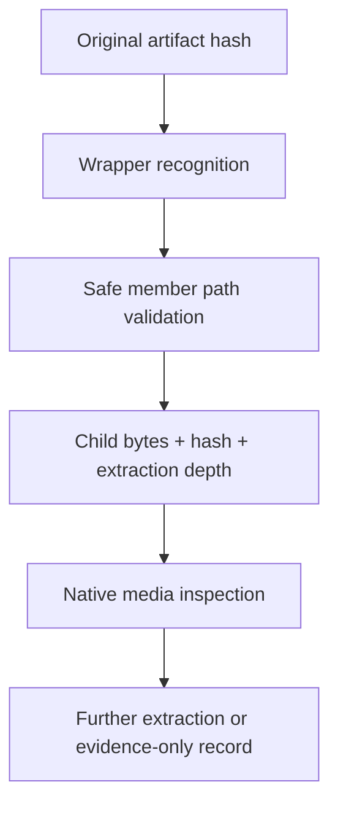

# Archive Wrappers and Recursive Extraction Safety

| Header field | Value |
| --- | --- |
| **Question** | How are archive wrappers recognized and recursively unpacked without losing hierarchy, accepting unsafe paths, or disguising external-tool dependence? |
| **Evidence scope** | P1 Harvester unpacker/test behavior; P0 archive-library format references where added per adapter. |
| **Status** | implementation contract with identified release gates |
| **Implementation links** | [`../../daad_harvester/unpack.py`](../../daad_harvester/unpack.py), [`../../tests/test_unpack.py`](../../tests/test_unpack.py) |
| **Non-claims** | A wrapper extension does not prove a successful decode, and an external CLI fallback is not native deterministic decoder evidence. |

## Current dispatch and safety rules

The unpacker recognizes ZIP, 7z, RAR, TAR/gzip/bzip2/xz, ARJ, LHA/LZH, ZOO, ARC, and CAB by a combination of signatures and suffixes, then recursively inspects emitted members. All adapter output must pass filename sanitization/path containment, extraction-depth controls, content hashing, and parent-child provenance recording.[1]

| Wrapper family | Current adapter posture | Report requirement |
| --- | --- | --- |
| ZIP / TAR and compressed TAR | In-process library/standard handling. | Retain original archive and every member path/hash. |
| 7z | `py7zr` adapter where available. | Record unavailable/encrypted/failed conditions explicitly. |
| RAR | `rarfile` path with optional external-tool assistance. | Report method/error; do not call it a native-only result. |
| ARJ, LHA/LZH, ZOO, ARC, CAB | Current code contains optional CLI fallback paths. | **Release gate remains open** until native/vendored deterministic decoding replaces production fallback. |

## Recursive provenance graph

## Mandatory rejection conditions

Absolute paths, parent traversal, invalid archive names, depth/size expansion limits, encryption without supported credentials, corrupt members, and adapter errors must be preserved as explicit results. No adapter may silently create host-path escapes or present a subset of entries as a complete archive.

## Release gate

The project’s format matrix correctly requires deterministic native or vendored decoders for all in-scope archives. Current CLI fallback paths are documented here as a measurable implementation gap; they must be replaced and tested before this family can be marked complete.[2]

## References

[1]: [`unpack.py`](../../daad_harvester/unpack.py) recursive dispatch and safety implementation
[2]: [Format capability matrix](FORMAT_CAPABILITY_MATRIX.md)
