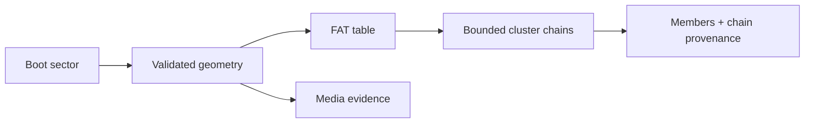

# FAT Media: MSX, Atari ST, and IBM PC/DOS

| Header field | Value |
| --- | --- |
| **Question** | How are FAT12/FAT16/VFAT images recognized, bounded, traversed, and reported across DAAD target contexts? |
| **Evidence scope** | P1 Harvester FAT parser/test corpus; P0 platform-specific media documentation where applicable. |
| **Status** | implementation contract |
| **Implementation links** | [`../../daad_harvester/platform_media.py`](../../daad_harvester/platform_media.py), [`../../daad_harvester/media_inspection.py`](../../daad_harvester/media_inspection.py), [`../../tests/test_platform_media.py`](../../tests/test_platform_media.py) |
| **Non-claims** | A boot sector, FAT image, or extracted filename does not prove platform, original interpreter identity, DOS executable behavior, or a valid DDB. |

## Recognize before traversing

The parser derives bytes-per-sector, sectors-per-cluster, reserved sectors, FAT count/size, root entries, and cluster regions from the boot sector before following directory or allocation chains. It accepts only bounded layouts and provides distinct FAT12/FAT16 entry handling; VFAT long-name sequences are checked against the corresponding short-name checksum.[1]

| Check | Required behavior | Preservation result on failure |
| --- | --- | --- |
| BPB/layout arithmetic | Regions must fit within image bounds and have nonzero coherent parameters. | Rejected FAT extraction; retain input/inspection evidence. |
| FAT type and entries | Cluster values must stay in valid data/bad/end ranges. | Reject the affected file chain; do not read arbitrary bytes. |
| Chain traversal | Track visited clusters and enforce a bound. | Reject cycle/out-of-range chain with path/provenance. |
| Directory names | Validate VFAT sequence/checksum before accepting long name. | Use validated short name or preserve unresolved evidence. |

## Target-context rule

MSX, Atari ST, and DOS can all present FAT-family media, but their target claims stay outside the filesystem parser. Harvester records `media_parser=fat12`/`fat16`, geometry, members, and validation independently; the platform dossier contributes runtime/DDB/provenance interpretation.[2]

## References

[1]: [`platform_media.py`](../../daad_harvester/platform_media.py) FAT12/FAT16/VFAT extraction contract
[2]: [MSX dossier](../platforms/MSX.md); [Atari ST dossier](../platforms/ATARI_ST.md); [IBM PC/DOS dossier](../platforms/IBM_PC_DOS.md)
