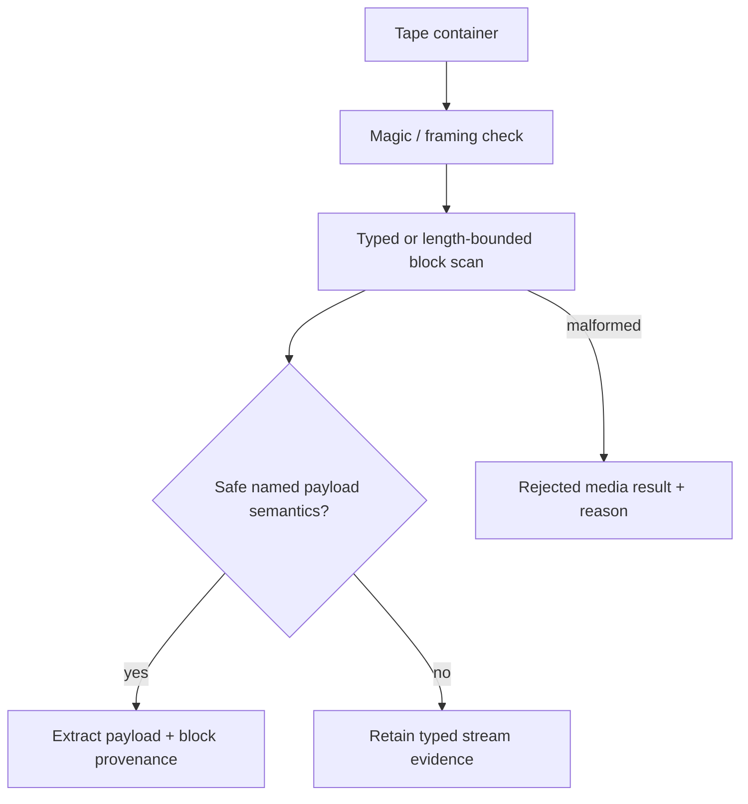

# Tape Streams: TAP, TZX/CDT, CBM TAP, and MSX CAS

| Header field | Value |
| --- | --- |
| **Question** | How are tape/pulse/cassette streams recognized, bounded, extracted where safely possible, and retained where replay semantics remain unresolved? |
| **Evidence scope** | P0 TZX/CDT and CBM references; P1 Harvester typed-scanner/extractor tests. |
| **Status** | implementation contract |
| **Implementation links** | [`../../daad_harvester/platform_media.py`](../../daad_harvester/platform_media.py), [`../../daad_harvester/media_inspection.py`](../../daad_harvester/media_inspection.py), [`../../daad_harvester/unpack.py`](../../daad_harvester/unpack.py), [`../../tests/test_platform_media.py`](../../tests/test_platform_media.py) |
| **Non-claims** | A parsed tape stream is not automatically a named file directory, a complete custom-loader decode, or proof of a specific DAAD runtime. |

## Recognition and evidence classes

| Family | Recognition basis | Safe extraction outcome | Evidence-only outcome |
| --- | --- | --- | --- |
| ZX TAP | Little-endian block lengths with bounded complete blocks. | Header-associated payloads where header/data pairing validates. | Truncated, orphaned, or nonstandard blocks retained with block offsets. |
| TZX / CPC CDT | `ZXTape!\x1A` header plus typed declared-length blocks; CDT uses the TZX inner representation. | Supported data block payloads. | Timing, control, generalized/custom/unsupported blocks with typed metadata. |
| CBM TAP | `C64-TAPE-RAW` or `C16-TAPE-RAW` identity. | No generic filename extraction contract. | Pulse-timing identity and counts. |
| MSX CAS | CAS record framing. | Bounded record members for recursive inspection. | Unresolved loader/record semantics. |

## Bounds and integrity contract

The TZX specification defines distinct data, signal, control, metadata, and custom block families. A compliant preservation scanner must advance through each by its declared structure, reject a block whose declared span crosses EOF, and retain type/offset/length for any block that cannot be semantically replayed or decoded.[1] CDT shares that block representation rather than defining a separate “CPC file” container.[2]

TAP is a sequence of length-prefixed blocks. Harvester associates valid Spectrum headers with subsequent data blocks but does not treat a partially present block as extractable. CBM TAP represents timing pulses rather than a generic member directory; it therefore remains structured low-level evidence unless a separately validated platform-specific decoder is applied.[3]

## Provenance fields

Every emitted member preserves outer artifact SHA-256, member path, block index/range, parser name, validation state, and extraction depth. Every evidence-only result preserves the same lineage plus a precise reason such as `pulse_stream`, `control_block`, `custom_block`, `unsupported_tzx_block`, or `truncated_block`.

## Release gate

Full custom-loader bitstream reconstruction remains a separate semantic/replay layer. It must be tested with redistributable fixtures and must never replace the original TZX/CDT/CBM TAP bytes. The current typed scanner’s preservation success criterion is complete structural accounting, not invented payloads.

## References

[1]: https://worldofspectrum.net/TZXformat.html "TZX format specification"
[2]: https://cpctech.cpcwiki.de/docs/cdt.html "CDT format specification"
[3]: https://vice-emu.sourceforge.io/vice_17.html "VICE CBM TAP and related file-format reference"
