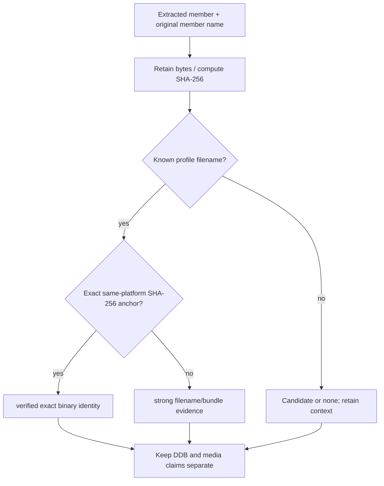

# Interpreter Identity Protocol

| Header field | Value |
| --- | --- |
| **Question** | How does Harvester identify a runtime without treating a name, location, or DDB as a binary-version claim? |
| **Evidence scope** | P0 retained official-distribution source; P1 SHA-256 measurement; P2 public derivative source; P3/P4 explicitly labelled only. |
| **Status** | implementation contract |
| **Implementation links** | [`../../daad_harvester/interpreter_profiles.py`](../../daad_harvester/interpreter_profiles.py), [`../../daad_harvester/fingerprint.py`](../../daad_harvester/fingerprint.py), [`OFFICIAL_PROFILE_LEDGER.md`](OFFICIAL_PROFILE_LEDGER.md) |
| **Non-claims** | An interpreter filename, platform directory, nearest DDB, successful derivative execution, or text resemblance never establishes exact original-runtime identity. |

## Evidence levels

Runtime identification is a byte-identity process. Harvester first preserves the observed media/member name and computes a SHA-256 from the extracted physical file. It then resolves the observation according to the following protocol.[1]

| Confidence | Required evidence | Permitted report wording | Explicit limitation |
| --- | --- | --- | --- |
| `verified` | SHA-256 exactly equals a provenance-qualified official profile for the same candidate platform. | “Exact match: `<profile_id>`.” | Identifies that file only; says nothing by itself about adjacent DDB version or playability. |
| `strong` | Observed original member filename matches a catalog candidate, but the bytes do not match an exact anchor. | “Filename/bundle candidate: `<profile_id>`; hash recorded.” | The file may be modified, repacked, regional, later, damaged, or otherwise unprofiled. |
| `candidate` | Contextual bundle/media observation without a profile filename or hash match. | “Candidate runtime neighbor.” | No runtime-family or version identity claim. |
| `none` | No meaningful runtime evidence. | “No identified interpreter file.” | Absence is not proof that the package is not DAAD. |

## Required sequence

## Same-platform and alias rules

The implementation computes candidate profiles from the observed filename and permits a hash comparison only against profiles from the candidate platform set. This permits a known historical alias to resolve to a byte-identical profile on that same platform while prohibiting a cross-platform match based on a coincidentally identical filename.[1]

The Plus/4 profile catalog contains a deliberately hashless historical `ediplus4` filename observation. It is valuable bundle evidence but cannot become `verified` until an exact anchor is measured from a provenance-qualified official historical distribution.[2]

## Correlation, not conflation

An artifact may accumulate independent evidence: a verified runtime, a DDB structural result, and a media/filesystem path. The bundle correlation is recorded as provenance, but no relation makes the runtime hash identify the DDB version or vice versa.

| Evidence item | Separate persisted value | Never infer |
| --- | --- | --- |
| Interpreter SHA-256 | `InterpreterMatch.sha256` and profile ID. | The adjacent database’s generation. |
| Observed member name | `InterpreterMatch.filename`. | Originality of altered bytes. |
| DDB validation | Structural fingerprint/version fields. | Executable identity. |
| Container/member path | Media provenance/evidence JSON. | Runtime behavior outside the observed bundle. |

## References

[1]: https://github.com/boolforge/DAAD-harvester/blob/main/daad_harvester/interpreter_profiles.py "Harvester interpreter-profile and same-platform matching implementation"
[2]: [Official profile ledger](OFFICIAL_PROFILE_LEDGER.md)
