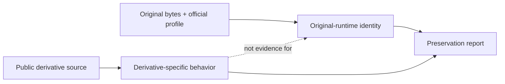

# Public Implementation Boundaries

| Header field | Value |
| --- | --- |
| **Question** | How must public DAAD-related implementations be classified so that their source availability is never misreported as original interpreter provenance? |
| **Evidence scope** | P0 public project source/licenses and maintainer documentation; P2 where behavior is derived from those public implementations. |
| **Status** | source-backed |
| **Implementation links** | [`../../daad_harvester/interpreter_profiles.py`](../../daad_harvester/interpreter_profiles.py), [`../derivatives/README.md`](../derivatives/README.md), [`IDENTITY_PROTOCOL.md`](IDENTITY_PROTOCOL.md) |
| **Non-claims** | A public derivative is not source code for the original proprietary DAAD interpreter, and a successful derivative run does not prove original-runtime compatibility. |

## Classification rule

The official DAAD distribution states that original interpreter source is not provided. This legal and evidential boundary applies even when public projects reproduce, extend, compile for, decompile, or otherwise interoperate with DAAD material.[1]

| Project | Correct classification | Preservation-safe use | Boundary |
| --- | --- | --- | --- |
| DRC | Public compiler replacement. | Validate its documented output contract; reproduce its compiler behavior. | Not an original interpreter or historical release oracle. |
| MSX2DAAD | Public from-scratch compatible interpreter. | Study/test its stated MSX2/MSX2+ V2/V3 behavior. | Not an original MSX binary identity. |
| Maluva | Public `EXTERN` extension. | Preserve source/assets and feature-scoped extension evidence. | Not a DDB generation or universal target guarantee. |
| PCDAAD | Public DOS VGA/SVGA interpreter. | Record its explicit feature differences and derivative runtime profile. | Its own README rejects full original-interpreter equivalence. |
| UnDAAD | Public, obsolete bounded decompiler. | Produce clearly labelled optional derivative analysis within stated early-DOS scope. | Output is not recovered source or normative format semantics. |

## Reporting rule

The report requires a project-qualified noun: “MSX2DAAD-compatible evidence,” “PCDAAD-specific unsupported condact,” or “UnDAAD-derived output.” It must not say “DAAD source,” “official interpreter behavior,” or “original format definition” unless a P0 official source independently supports that exact claim.

## Lawful research boundary

Harvester may cite public licenses, source code, manuals, and reproducible observations. It must not decompile proprietary interpreter binaries, redistribute them as source, or imply that compatible open code is an extracted/reconstructed original. This boundary is a preservation strength: it makes claims reproducible and legally traceable.[1] [2]

## References

[1]: [Primary DAAD sources ledger](../sources/PRIMARY_DAAD.md)
[2]: [Public implementation source ledger](../sources/PUBLIC_IMPLEMENTATIONS.md) and [derivative dossiers](../derivatives/README.md)
