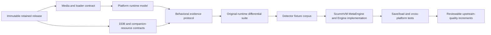

# ScummVM DAAD Engine Readiness Gate and Methodology

| Header field | Value |
| --- | --- |
| **Question** | What evidence and upstream-integration prerequisites must be satisfied before native ScummVM DAAD-engine source is allowed? |
| **Evidence scope** | P0/P1 preservation evidence, explicitly scoped P2 compatibility observations, and a pinned public ScummVM upstream snapshot. |
| **Status** | Not ready for native ScummVM engine implementation. |
| **Decision rule** | An implementation phase begins only after every mandatory readiness domain is independently evidenced for its stated scope. |
| **Current repository basis** | 265 retained sources, 1,015 retained artifacts, and 42 exact-profile static-analysis inputs with 294 derived outputs. |
| **Upstream reference snapshot** | ScummVM `master` revision `f882fd670ad0397cdc3609725b1bccf56f6a810a`, observed 2026-08-22. |
| **Non-claims** | Static-analysis success, a format parser, a public derivative, or an upstream engine template does not establish DAAD runtime behavior or ScummVM readiness. |

## Purpose

This document is the mandatory entry gate for any future native DAAD engine in
ScummVM. It converts the broad future-engine goal into reviewable evidence
domains, measurable exit criteria, and a clean-room implementation sequence.
It does not authorize an engine scaffold, detector entry, or platform runtime
claim. The preservation repository remains the specification and evidence
environment; a future engine must implement only behavior independently justified
by that environment.

> **Gate rule:** A missing runtime, format, load-model, detector, or differential
> test is not implementation freedom. It is a named blocker with a reproducer.

## Current readiness assessment

| Readiness domain | Present evidence | Required before engine source | Decision |
| --- | --- | --- | --- |
| Corpus identity and provenance | Retained identity, lineage, and checksums exist for 1,015 artifacts. | A scoped, authorized, detector-eligible corpus with immutable per-release identities. | **Incomplete** |
| Platform media and loaders | Multiple media parsers and structural validators exist. | Proven loader, origin, memory, bank, relocation, and entry contracts for each executable profile. | **Incomplete** |
| DDB grammar and recompiler | Native grammar and bounded round-trip evidence exist. | Full profile/version coverage, unknown-construct ledger, and byte-identical or actively iterated exception records. | **Incomplete** |
| Companion graphics, fonts, and audio | Some profile-scoped resource work is validated. | Complete profile contracts and deterministic rendering or decoding for every engine-supported resource. | **Incomplete** |
| Interpreter behavior | Exact-profile static analysis is retained and verified. | Platform-specific dynamic behavioral evidence; static listings must not become semantic facts by implication. | **Incomplete** |
| Cross-tool analysis | Three-tool static records exist for 42 inputs. | Explicit origin/entry models and a material-disagreement ledger for every admitted runtime profile. | **Incomplete** |
| Original-runtime differential suite | A future requirement only. | Scripted original-runtime versus engine observations, state checkpoints, captures, and failure deltas. | **Missing** |
| ScummVM detector specification | No DAAD detector is implemented. | Stable release signatures, required/optional files, variants, language/platform metadata, and negative fixtures. | **Missing** |
| ScummVM engine integration | Upstream template and representative engine structure were inspected. | A completed DAAD semantics and subsystem map backed by the preceding domains. | **Blocked by earlier domains** |
| Upstream-quality verification | Repository-native checks exist for preservation code. | ScummVM build/test matrix, save/load tests, detector tests, portability checks, and reviewable incremental commits. | **Missing** |

The current evidence therefore supports continued preservation, parser, and
analysis work. It does **not** support a claim that a universal DAAD runtime can
be faithfully implemented or upstreamed today.

## Required evidence flow

Each arrow is an evidence dependency, not a scheduling preference. The output of
an external analyzer may inform investigation, but it must be tied to immutable
input identity, a justified load model, recorded configuration, output checksums,
and an independently supported claim before it crosses an arrow.

## ScummVM integration model

The upstream tree contains an engine generator with detector, MetaEngine, module,
configuration, and credit templates. Representative engines expose corresponding
`detection.cpp`, `metaengine.cpp`, `module.mk`, and `configure.engine` files. The
future DAAD work must map its evidence into these existing integration boundaries
rather than creating a parallel runtime framework.[1] [2] [3]

| ScummVM integration concern | DAAD-engine prerequisite | Required implementation evidence |
| --- | --- | --- |
| Detection | Immutable signatures for each supported DAAD release/variant. | Positive and negative directory fixtures, complete checksums, required/optional companion-file rules, and no filename-only detection. |
| MetaEngine | Supported-target scope and feature policy. | Explicit mapping from verified release metadata to target IDs, language, platform, GUI options, and save capabilities. |
| Engine lifecycle | Verified DAAD execution semantics. | State machine covering startup, load, command parse, condition/action execution, rendering, sound, transitions, error handling, and shutdown. |
| File and resource access | Validated platform bundle relationships. | Byte-bound file resolution, resource ownership, optional/missing-resource outcomes, and corruption rejection. |
| Graphics and text | Validated picture/font profiles. | Native decoder references, deterministic expected images, palette/attribute behavior, and explicit unsupported profiles. |
| Audio | Validated audio/media profiles. | Timing, decoder, event, and original-media evidence without guessed playback. |
| Save/load | Defined portable engine state. | Versioned save schema, corruption rejection, compatibility policy, and differential checkpoint restoration. |
| Debugging and diagnostics | Evidence-preserving observability. | Stable trace identifiers that distinguish measured input, implementation state, unsupported behavior, and assertion failure. |
| Build integration | Current upstream build conventions. | `configure.engine`, `module.mk`, feature guards, credits, and full configured/unconfigured build coverage. |

## Implementation methodology after the gate passes

The engine must be developed as small, reviewable ScummVM-facing increments. A
first increment may only implement release detection for fixtures whose byte
identity and required files are already verified. A later runtime increment may
only add a behavior when a platform-neutral behavioral evidence record defines
its input, expected state change, and observable output. Unsupported opcodes,
resource layouts, machine hooks, and timing rules must fail with a diagnosable
state rather than falling through to an approximation.

Every increment requires the following sequence.

| Step | Required artifact | Rejection condition |
| --- | --- | --- |
| 1 | Evidence packet with source identity, hashes, loader model, and scope. | Any inferred release, base address, entry, or resource relation. |
| 2 | Executable specification derived from P0/P1 evidence and explicitly scoped P2 compatibility notes. | A static disassembly or third-party implementation silently used as behavior authority. |
| 3 | Focused ScummVM detector or runtime test plus an original-runtime differential checkpoint where applicable. | A passing engine-only test without an evidenced oracle. |
| 4 | Build, save/load, portability, and regression results. | Feature-specific success that breaks a supported configuration or save contract. |
| 5 | Independent review packet containing change scope, known deviations, corpus coverage delta, and reproducer. | A broad “universal” claim from a single profile. |

## Upstream research protocol

ScummVM practices evolve. Before every future engine milestone, refresh the
upstream reference snapshot and inspect the then-current generator templates,
comparable engine detector and MetaEngine code, build configuration, testing
conventions, and recently merged engine or detection changes. Record pull-request
scope, changed subsystem paths, publicly visible review discussion where present,
and the rule adopted or rejected for DAAD. A current example is the AGS detection
and support increment merged as pull request 7721, which changed detector tables
and engine plugin implementation together rather than treating game recognition
as an isolated user-interface list.[4]

This protocol treats upstream commits and reviews as engineering guidance, not as
a substitute for DAAD behavior evidence. A future DAAD proposal must be split so
that each reviewable change explains its detector data, runtime semantics,
resource behavior, tests, save/load impact, and unresolved limitations.

## Explicit pre-implementation exit checklist

Native ScummVM DAAD source remains prohibited until every item below is marked by
evidence record, regression, and reproducible command for its declared target
scope.

1. The corpus-completeness audit identifies the supported release set and every
   excluded or unresolved family.
2. Every supported platform has a measured loader and runtime model, including
   memory/segment/bank/relocation behavior as applicable.
3. Every supported DDB and companion profile has a complete contract or an
   explicit unsupported boundary that excludes it from engine support.
4. Decompile/recompile and parser/compiler evidence records byte identity or
   retain an active precise difference record for every supported profile.
5. Interpreter behavior is specified through evidence and differential runtime
   observations rather than decompiler output.
6. Detector fixtures prove release identity, variant discrimination, and
   rejection of near matches.
7. A platform-neutral behavioral evidence protocol drives original-runtime versus
   implementation comparisons, including save/load checkpoints.
8. ScummVM subsystem mapping, build configuration, portability, and test
   requirements are refreshed against a pinned upstream revision.
9. An independent readiness audit verifies all prior items and rejects broad
   completion claims that exceed the evidence ledger.

## References

[1]: https://github.com/scummvm/scummvm/tree/f882fd670ad0397cdc3609725b1bccf56f6a810a/devtools/create_engine "ScummVM engine generator at the observed upstream revision"
[2]: https://github.com/scummvm/scummvm/tree/f882fd670ad0397cdc3609725b1bccf56f6a810a/engines/ultima "Representative ScummVM engine with detector, MetaEngine, and module integration"
[3]: https://github.com/scummvm/scummvm/tree/f882fd670ad0397cdc3609725b1bccf56f6a810a/engines/sci "Representative multi-subsystem ScummVM engine layout"
[4]: https://github.com/scummvm/scummvm/pull/7721 "AGS detection and support increment, merged 2026-07-30"
[5]: ../RESEARCH_METHODOLOGY.md "DAAD preservation evidence ladder and clean-room methodology"
[6]: ../reverse_engineering/ARCHITECTURE_WORKFLOWS.md "Architecture-specific static-analysis boundaries and current profile evidence"
