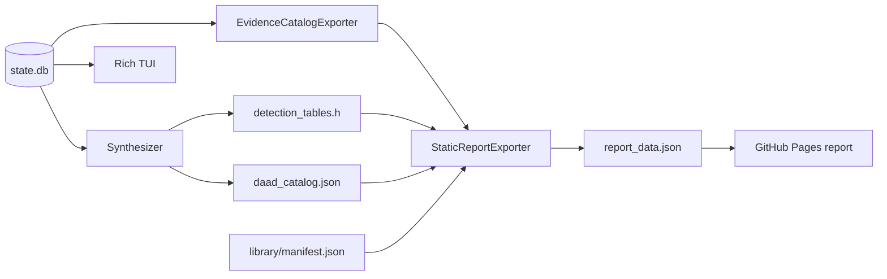

# Public Report and TUI Evidence Contract

| Header field | Value |
| --- | --- |
| **Question** | What can the GitHub Pages report and terminal UI show, search, group, copy, link, download, or leave unknown without exceeding measured DAAD preservation evidence? |
| **Evidence scope** | P1 implementation contract for `report_data.json`, generated `detection_tables.h`, library manifest, current SQLite-backed TUI state, and their read-only consumers. |
| **Status** | implementation contract and improvement backlog |
| **Implementation links** | [`../../daad_harvester/catalog.py`](../../daad_harvester/catalog.py), [`../../daad_harvester/report_export.py`](../../daad_harvester/report_export.py), [`../../daad_harvester/synthesize.py`](../../daad_harvester/synthesize.py), [`../../daad_harvester/tui.py`](../../daad_harvester/tui.py), [`../../web/report-viewer/src/Home.tsx`](../../web/report-viewer/src/Home.tsx), [`../../tests/test_report_export.py`](../../tests/test_report_export.py), [`../../tests/test_tui.py`](../../tests/test_tui.py), [`../../tests/test_tui_rendering.py`](../../tests/test_tui_rendering.py) |
| **Non-claims** | A catalog title is not a measured release; a listed platform is not necessarily a retained binary port; a checksum identifies the exported artifact, not an unmeasured interpreter/version; a generated detection header is not proof that a universal ScummVM engine exists or runs the title. |

> **Evidence-first interface rule.** The report and TUI are read-only evidence instruments. They may improve discoverability and copyability, but they must never convert a catalog association into a binary claim, a filename into an identity, an absent byte into a download, or an optional validator result into the primary preservation path.

## 1. Current deterministic data flow

`Synthesizer` writes the C++ detection header and catalog from deterministic database state. `StaticReportExporter` reads those committed outputs, strips local extraction paths, and writes browser-safe `report_data.json`. The TUI reads the typed database directly. The Pages workflow verifies the committed primary gate, stages the committed report/detection/library outputs, builds the viewer, and checks the deployed report JSON by SHA-256.[1]

## 2. Evidence vocabulary visible in interfaces

| User-facing term | Required data origin | Meaning | Forbidden inference |
| --- | --- | --- | --- |
| **Known title** | `catalog.games` / known-game catalog. | Catalog-backed title record with stated platform evidence and source URLs. | That a specific retained artifact exists on every listed platform. |
| **Port/platform evidence** | `game.platform_evidence`, source platform, artifact measured/legacy platform fields. | Explicitly labelled catalog or measured association. | That catalog platform evidence is measured binary identity. |
| **Retained artifact** | Artifact record and SHA-256. | A persisted original/container/member/derived evidence object. | That it is necessarily a game DDB or runnable release. |
| **Source container** | Artifact with a validated outer container/technical-medium parser and no parent member. | Retained outer byte object, for example a ZIP archive, C64 D64 disk image, CPC DSK disk image, TAP/TZX/CDT tape image, executable, or other recorded medium. | That every child has a measured DDB platform or interpreter correlation. |
| **Extracted medium/member** | Artifact container-member provenance, archive depth, and media parser/status. | Byte emitted from a recorded parent container or medium; its source-platform claim and its own parser status remain separate. | That an opaque member has an established content semantics merely because its filename contains `PIC`, `PART`, `CODE`, or a platform-like suffix. |
| **Derived recovery** | Recorded deterministic recovery procedure plus retained derived byte and validation. | A preservation-derived evidence object, such as a validated runtime RAM recovery, explicitly distinct from original source media. | That it is an original release file or that an unrelated sibling interpreter is identified. |
| **Media/resource payload** | Member provenance and available native structural evidence. | Support byte associated with a retained title or medium; it may be a program, screen, image/resource, font, packet, or currently opaque payload. | A semantic category not established by the byte or a filename. |
| **Verified DDB** | Structural parser result (`is_daad_payload`). | Artifact whose DDB structure passed the documented validator. | That its interpreter identity or playable semantics are proved without independent evidence. |
| **Interpreter identity** | Artifact-own-byte profile/hash evidence. | Exact or documented identity claim scoped by platform. | Identity inherited from another platform sibling or filename alone. |
| **Checksum** | Artifact fields generated by the native `compute_hashes` suite. | Copyable integrity identifiers for that exact artifact byte sequence: MD5 full/head/tail, SHA-1/224/256/384/512, SHA3-256/512, BLAKE2b/s, CRC-32, Adler-32, and XXH32/64/128. | A game family, platform port, or runtime version claim beyond its record. |
| **ScummVM detection entry** | Deterministic `detection_tables.h` / `daad_catalog.json`. | Generated metadata handoff from verified/current catalog state. | A complete engine implementation or emulator-equivalence proof. |
| **Download** | Deterministic public-artifact manifest `public_path` plus matching staged byte. | Downloadable authorized retained media or generated metadata, including containers, DDBs, tapes, ROMs, disks, executables, interpreters, captures, and derived outputs. | A local extraction path, filename-derived URL, source page, or unmanifested corpus byte. |
| **Unknown** | Explicit null/absence/sentinel. | Evidence not present in current output. | A value inferred by UI formatting or friendly naming. |

## 3. Required web-report behavior

The public report must serve three audiences simultaneously: a newcomer needing a concise project explanation, a preservation researcher checking provenance and hashes, and a future implementer locating deterministic handoff data. It must retain the current evidence boundary while adding the following measured interactions.

| Surface | Required behavior | Evidence guardrail | Test expectation |
| --- | --- | --- | --- |
| Front page | Explain preservation purpose, canonical nine target platforms, evidence ladder, self-contained rule, and current measured/corpus boundary before dashboard metrics. | Copy comes from versioned project/documentation contract; no unsupported completion claim. | Presence of project/boundary text in built viewer. |
| Game explorer | Group catalog titles, show platform evidence by title, and distinguish catalog platform from retained measured artifacts. | Use labelled source of each association. | A real `report_data.json` fixture demonstrates a catalog-only title and a measured artifact separately. |
| Complete game evidence | Show every source-associated retained artifact by default in deterministic source/lineage order; compact mode, if offered, is an explicit reader choice. | The default must not hide D64, DSK, TAP, TZX, ZIP, PRG, DDB, packet, resource, or derived-recovery records. | A real multi-format game fixture asserts all records are present without an expander action. |
| Port matrix | Present each title’s catalog platform set and measured-artifact platform set in separate visual rows. | No merged “available on” claim. | Empty/mixed sets remain visibly distinct. |
| Format legend | Define every displayed lineage role and technical-medium term above the game list and on the game detail surface. | A filename label is never the sole explanation of an artifact type. | D64, DSK, TAP/TZX/CDT, ZIP, DDB, derived recovery, opaque member, and resource terms are present in the rendered output. |
| Artifact detail | Show original filename, source platform claim, lineage role, container/medium format, parent member where recorded, parser status/validation, DDB/interpreter evidence, size, and every recorded complete checksum with labelled copy actions. | Preserve unknown/not-correlated state only for the field that lacks evidence; never replace a source-backed technical medium with a bare `unknown`. | A C64 D64 container, an extracted opaque member, a tape packet, and a derived verified DDB fixture each render their distinct boundary. |
| Entity deep link | Every visible game, source-associated port evidence, artifact, and detection handoff has a stable URL/fragment that restores its detail surface. | Routes use only exported IDs and never expose a local path or invent a release relationship. | A browser regression opens a shared link directly and asserts the matching entity/detail boundary. |
| URL state | Safe text filter, platform filter, current section, and selected entity are serialised in URL state. | Query state filters existing evidence only; it does not mutate, write, or synthesize data. | Back/forward and page refresh restore the same evidence selection. |
| Accessibility | Detail triggers are semantic links/buttons with focus visibility, label text, keyboard operation, and an announced detail heading. | Decorative cards cannot be the sole path to evidence. | Keyboard and screen-reader-oriented regression covers list-to-detail/back navigation. |
| Search/filter | Search title, filename, hash, platform, interpreter, DDB format, and evidence class. | Filtering must not mutate or synthesize records. | Query results are deterministic for a real fixture. |
| Detection handoff | Show count, bounded header preview, deterministic provenance, and a download only when `detections.available` and `download_path` are present. | “Generated header” never becomes “engine works.” | Absent header has no active download; present header is downloadable. |
| Library/source navigation | Link to published metadata or recorded source URL only where included in the export/deployment. | No local path, unauthorized byte, or fabricated link. | Missing/withheld item is explicit. |
| Artifact download | Offer a direct download only from the artifact manifest’s staged public path; accompany it with full checksums, size, provenance, and evidence state. | Never infer a public asset from `extracted_path`, filename, or source URL. | Staged byte/hash comparison and no-link behavior for unmanifested evidence. |
| Documentation | Link to CI-rendered documentation and traceability contract from the report. | Documentation is a reader, not an evidence generator. | Build includes documentation index and valid links. |

## 4. Required TUI behavior

The TUI is an operational instrument, not a decorative live dashboard. It must be usable in terminal widths that preserve evidence readability and must expose the same claim boundaries as the report while retaining local pipeline operations.

| TUI area | Required behavior | Current baseline | Required improvement |
| --- | --- | --- | --- |
| Orientation | State purpose, selected corpus/database, phase, evidence policy, and key task shortcuts. | Header shows version, phase, theme, and filter. | Add a concise preservation/boundary line and task-oriented help panel. |
| Artifact ledger | Navigate retained artifacts with platform, evidence status, size, and checksum visibility. | Ledger offers selection, search, inspector, partial MD5. | Add all-algorithm checksum access, evidence-kind filter, and source/DDB/interpreter status columns. |
| Artifact inspector | Show all recorded hash/evidence fields safely. | Inspector shows a partial checksum subset and bounded evidence JSON. | Show the full native digest suite, source provenance/member lineage, and explicit measured-versus-catalog labelling. |
| Game/port explorer | Navigate title → catalog ports → measured artifacts without conflation. | Dedicated game/port tab separates catalog, source, and measured-artifact platforms and shows complete source-associated lineage. | Add reversible title/port entity drill-down while preserving the existing no-runnable-port boundary. |
| Entity drill-down | Select a game, port evidence, artifact, source, checksum, or detection record and expose a reversible detail view. | Summary/list state only. | Add deterministic selection, breadcrumbs, Enter/detail and Back/Escape behavior matching the web entity model. |
| Detection handoff | Expose generated header availability/count/path/provenance. | Dedicated detection panel shows header availability, bounded preview, SHA-256, generator identity, and an explicit unavailable state. | Preserve the current read-only boundary while adding any future terminal-safe handoff navigation only with explicit provenance. |
| Acquisition queue | Show source priority and status. | Existing priority tab. | Add reason/evidence-source display and source URL copy/open command where terminal-safe. |
| Accessibility/resilience | Keyboard-first navigation, no Rich markup injection, safe non-TTY behavior, platform themes without semantic changes. | Existing tests cover escaped markup, empty rendering, key navigation, and themes. | Retain these regressions while adding new evidence-navigation tests. |

## 5. ScummVM detection-file contract

The generated `preservation_corpus/detection_tables.h` is a **deterministic metadata output**. It is generated by `daad_harvester/synthesize.py` together with `daad_catalog.json`, included in `report_data.json` by `report_export.py`, verified by the primary gate, and published by Pages only as a generated header when present.[1]

| Requirement | Contract |
| --- | --- |
| Generation | Use repository-native `Synthesizer` over retained database/catalog state; no manual header editing. |
| Escaping | C++ output must use the synthesizer’s explicit escaping rules; test title/filename strings containing quotes or backslashes. |
| Provenance | Report exposes availability, entry count, bounded preview, and relative download path; documentation links to generator, input boundary, and non-claim. |
| Integrity | A corpus/report mutation refreshes the header and report in the same evidence gate when affected. |
| UI | Web/TUI state whether the file is available and how many entries exist; download is active only when exported. |
| Boundary | Detection metadata is not a universal engine, a decompiler/recompiler result, playable-game certification, or emulator-equivalence evidence. |

## 6. Interface test matrix

| Requirement class | Required regression style |
| --- | --- |
| Contract export | Real database fixture → static export; assert fields, local-path removal, detection availability, unknown behavior. |
| Web consumer | Build/type-check plus component/browser test against a committed/realistic `report_data.json`; assert project explanation, title/port separation, hash interaction, detection/download boundary, and documentation navigation. |
| Web deep linking | Browser test opens game/artifact/detection URLs directly, restores safe query state, follows list-to-detail/back controls, and confirms no local path is rendered. |
| TUI rendering | Rich-rendering regression for empty state, real artifact/game/port/detection state, narrow terminal handling, keyboard navigation, reversible entity drill-down, safe text/markup, and bounded inspector fields. |
| Public delivery | CI validates report JSON exact SHA-256 and documentation index after Pages deployment. |
| Complete-view contract | CI validates a real multi-format game export and the production viewer build for default-complete artifact rendering, lineage labels, source/platform distinctions, and format legend text. |
| TUI parity | CI validates that the terminal inspector renders the same source platform, lineage role, medium/parser explanation, measured DDB state, and independent interpreter boundary as the web report. |
| Documentation coherence | Documentation integrity checks validate the generated-output/contract navigation and require the vocabulary used by the report and TUI to remain defined in versioned documentation. |
| Corpus coupling | Primary workflow verifies manifests/report/corpus before UI build; output mismatch is a release failure. |

## 7. Implementation sequence and non-terminal gaps

The current report and TUI provide evidence-led foundations, but the requirements in §§3–6 are intentionally stronger than the current presentation. The work is tracked in [`TODO.md`](../../TODO.md) and must proceed through the bounded-change protocol in [the traceability contract](TRACEABILITY_AND_CONTINUITY.md). No missing explorer, hash action, port distinction, introductory surface, TUI panel, or test is treated as an accepted permanent limitation.

## References

[1]: [`synthesize.py`](../../daad_harvester/synthesize.py), [`report_export.py`](../../daad_harvester/report_export.py), [static report contract](../schemas/STATIC_REPORT_CONTRACT.md), [Pages report contract](../PAGES_REPORT.md), and [Pages workflow](../../.github/workflows/pages.yml).
