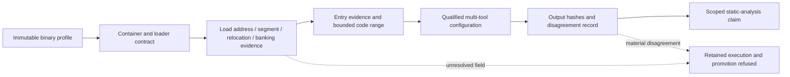

# Architecture-Family Qualified Analysis Campaign

| Header field | Value |
| --- | --- |
| **Question** | How will each retained DAAD interpreter family move from raw-base static output to a qualified, evidence-bounded analysis configuration? |
| **Evidence scope** | Retained profile records, measured container bytes, committed platform contracts, and architecture-specific external-tool outputs with recorded hashes. |
| **Status** | Long-horizon campaign. The C64 PRG wrapper and BASIC entry slice is verified; no family has yet completed qualified cross-tool analysis. |
| **Non-claims** | A qualified container/load configuration does not recover source, establish complete runtime behavior, or prove universal compatibility. |

## Campaign model

Every family must satisfy the same progression, but with a platform-specific
definition of load, origin, entry, relocation, memory, and environment. A tool
listing is retained evidence only after its input, configuration, and outputs
are hash-bound; it becomes a qualified analysis only after the family contract
is complete enough to reject an unsupported invocation.

## Family workstreams

| Family | Retained profiles | Directly measured starting point | Remaining contract gates before qualified reanalysis |
| --- | ---: | --- | --- |
| MOS 6502 / C64 | 2 | PRG load `0x0801`; tokenized BASIC `SYS 2063:REM`; declared entry `0x080F`. | Processor-port/banking and I/O state, precise program image mapping, qualified tool inputs excluding the PRG wrapper, disagreement record. |
| MOS 8501 / Plus/4 | 2 | PRG wrapper begins at `0x4001`; launcher bytes require target-specific semantic validation. | TED/ROM/RAM mapping, launcher interpretation, machine-code origin and entry, qualified configuration, disagreement record. |
| Z80 / ZX, CPC, MSX, PCW | 8 | Retained files have distinct container signatures and leading byte forms; no common raw-base model is permitted. | One loader/memory/bank/entry contract per platform and container family, then per-profile qualified configuration and disagreement record. |
| Motorola 68000 / Amiga | 4 | Amiga executable headers are retained and distinguishable. | Hunk/segment interpretation, relocation, entry, OS/library and memory model, qualified configuration, disagreement record. |
| Motorola 68000 / Atari ST | 4 | Atari ST executable headers are retained and distinguishable. | PRG header/segment/relocation interpretation, TOS memory and entry model, qualified configuration, disagreement record. |
| i8086 / DOS | 22 | All retained profiles begin with `MZ`; the DOS admission contract already names the required MZ fields. | Per-profile page/header/relocation/load-module/CS:IP/SS:SP/PSP/overlay validation, then qualified configuration and disagreement record. |

The current profile counts are inventory counts, not completed-family counts.

## Near-term dependency order

The C64 PRG wrapper establishes the first directly measured load and entry
slice. The next container-verifiable increments should build out the MOS 8501
PRG distinction, the 22-profile DOS MZ field ledger, Amiga/Atari header and
segment parsers, and separate Z80 platform loader contracts. They can share
common JSON identity and corruption-test conventions, but they must not share a
fictional universal origin or memory model.

> **Refusal rule:** A profile remains `raw_binary_base_0_unverified` until its
> own contract supplies the fields the selected tool configuration requires. A
> broader family result cannot silently promote a sibling platform or release.

## C64 evidence boundary

The C64 BASIC `SYS` command transfers control to its specified 16-bit address.
The processor-port configuration determines the visibility of BASIC, KERNAL,
character-ROM, RAM, and I/O areas; VICE snapshots preserve both CPU port state
and RAM configuration.[1] [2] The retained official PRGs establish their wrapper
and `SYS` entry, but no retained capture has yet shown the processor-port state
at that exact entry. Therefore the C64 qualified-analysis gate remains open.

## References

[1]: https://www.c64-wiki.com/wiki/SYS "C64 BASIC SYS command semantics"
[2]: https://vice-emu.sourceforge.io/vice_9.html "VICE snapshot modules and C64 memory configuration"
[3]: https://sta.c64.org/cbm64mem.html "Commodore 64 memory map and processor-port configuration"
[4]: [Architecture-specific analysis workflows](ARCHITECTURE_WORKFLOWS.md)
[5]: [Official C64 PRG load and BASIC-entry admission](C64_PRG_LOAD_MODEL_ADMISSION.md)
