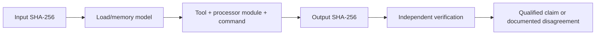

# Architecture-Specific Analysis Workflows

| Header field | Value |
| --- | --- |
| **Question** | What reproducibility information must an analysis workflow capture before a DAAD interpreter/disassembly result can be reviewed by architecture? |
| **Evidence scope** | P0 published tool/processor documentation; P1 retained binary hash, load model, commands, and generated-output checksums. |
| **Status** | implementation contract; no artifact analysis recorded yet |
| **Implementation links** | [`../schemas/REVERSE_ENGINEERING_MANIFEST.md`](../schemas/REVERSE_ENGINEERING_MANIFEST.md), [`CROSS_TOOL_VERIFICATION.md`](CROSS_TOOL_VERIFICATION.md), [`../platforms/README.md`](../platforms/README.md) |
| **Non-claims** | A platform name does not itself establish an executable’s CPU mode, load address, banking behavior, entry point, or correct tool configuration. |

## Required workflow record

Each run records the exact input SHA-256, declared architecture, processor module/version, byte order, load/base address, memory map, entry-point hypothesis, bank/overlay state, command/configuration hash, and output SHA-256. When any field is unknown, the run is marked incomplete and produces an evidence note rather than a source-level claim.

| Workflow family | Candidate platform contexts to verify | Minimum additional model |
| --- | --- | --- |
| Z80-family | ZX, CPC, MSX, PCW candidate runtimes. | Load address, paging/banking, ROM/RAM assumptions, interrupt/vector context. |
| MOS 6502/8501-family | C64 and Plus/4 candidate runtimes. | Load address, KERNAL/TED/VIC environment, banking/I/O map, PRG wrapper relation. |
| Motorola 68000-family | Atari ST and Amiga candidate runtimes. | Executable/segment layout, relocation model, OS/library assumptions, big-endian memory map. |
| 8086-family | IBM PC/DOS candidate runtimes. | COM/MZ load model, segment registers, relocation table, DOS/BIOS assumptions. |

The table is an analysis-planning taxonomy, not an assertion about a particular input. An artifact must independently justify the chosen family and all load-model fields through its own bytes, container provenance, or primary documentation.

## Reproducibility packet

## References

[1]: [Reverse-engineering manifest schema](../schemas/REVERSE_ENGINEERING_MANIFEST.md)
[2]: [Cross-tool verification](CROSS_TOOL_VERIFICATION.md)
[3]: [Platform dossier index](../platforms/README.md)
