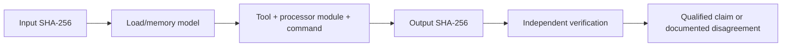

# Architecture-Specific Analysis Workflows

| Header field | Value |
| --- | --- |
| **Question** | What reproducibility information must an analysis workflow capture before a DAAD interpreter/disassembly result can be reviewed by architecture? |
| **Evidence scope** | P0 published tool/processor documentation; P1 retained binary hash, load model, commands, and generated-output checksums. |
| **Status** | measured implementation contract; one successful exact-hash pilot per processor family |
| **Implementation links** | [`../../reverse_engineering/workflows/toolchain.json`](../../reverse_engineering/workflows/toolchain.json), [`../../scripts/run_reverse_analysis.py`](../../scripts/run_reverse_analysis.py), [`../schemas/REVERSE_ENGINEERING_MANIFEST.md`](../schemas/REVERSE_ENGINEERING_MANIFEST.md), [`CROSS_TOOL_VERIFICATION.md`](CROSS_TOOL_VERIFICATION.md) |
| **Non-claims** | A platform name does not itself establish an executable’s CPU mode, load address, banking behavior, entry point, or correct tool configuration. |

## Required workflow record

Each run records the exact input SHA-256, declared architecture, processor module/version, byte order, load/base address, memory map, entry-point hypothesis, bank/overlay state, command/configuration hash, and output SHA-256. When any field is unknown, the run is marked incomplete and produces an evidence note rather than a source-level claim.

| Workflow family | Candidate platform contexts to verify | Minimum additional model |
| --- | --- | --- |
| Z80-family | ZX, CPC, MSX, PCW candidate runtimes. | Load address, paging/banking, ROM/RAM assumptions, interrupt/vector context. |
| MOS 6502/8501-family | C64 and Plus/4 candidate runtimes. | Load address, KERNAL/TED/VIC environment, banking/I/O map, PRG wrapper relation. |
| Motorola 68000-family | Atari ST and Amiga candidate runtimes. | Executable/segment layout, relocation model, OS/library assumptions, big-endian memory map. |
| 8086-family | IBM PC/DOS candidate runtimes. | COM/MZ load model, segment registers, relocation table, DOS/BIOS assumptions. |

The table is an analysis-planning taxonomy, not an assertion about a particular input. An artifact must independently justify the chosen family and all load-model fields through its own bytes, container provenance, or primary documentation.

## Installed redundant tool stack

The exact command, processor mode, version, and output hashes are retained in [`toolchain.json`](../../reverse_engineering/workflows/toolchain.json) and each artifact’s `analysis-run.json`. Ghidra provides a structured listing, function table, and **tool-derived pseudocode**; radare2 produces an independent control-flow-aware listing; each processor family has a separate static disassembler. Hatari and DOSBox-X are installed as future behavioral/emulator verification tools, but no emulator trace is claimed by the current static pilots.[1] [2] [3]

| Architecture | Structured analyzer/decompiler | Independent control-flow analyzer | Independent static disassembler | Required future behavioral model |
| --- | --- | --- | --- | --- |
| Z80 | Ghidra 12.1.3, `z80:LE:16:default` | radare2 5.5.0, `z80` / 8-bit | z80dasm 1.1.6 | ZX/CPC/MSX/PCW memory map, paging, vectors. |
| MOS 6502 | Ghidra 12.1.3, `6502:LE:16:default` | radare2 5.5.0, `6502` / 8-bit | da65 2.19 | C64 memory/I/O and load-header model. |
| MOS 8501 | Ghidra 12.1.3, `6502:LE:16:default` | radare2 5.5.0, `6502` / 8-bit | da65 2.19 | Plus/4 TED and banking model. |
| Motorola 68000 | Ghidra 12.1.3, `68000:BE:32:default` | radare2 5.5.0, `m68k` / 32-bit | GNU m68k objdump 2.42 | Atari ST/Amiga executable, relocation, and OS model. |
| 8086 | Ghidra 12.1.3, `x86:LE:16:Real Mode` | radare2 5.5.0, `x86` / 16-bit | NDISASM 2.16.01 | DOS COM/MZ segment and relocation model. |

All current pilots intentionally use `raw_binary_base_0_unverified`. That supports deterministic byte-to-instruction comparison, but it does **not** establish correct runtime origin, section layout, relocation handling, hardware mapping, or semantic control flow.

## Measured processor-family pilots

The runner produced a self-contained output directory for one exact-profile input in every processor family. Every pilot generated seven retained files: radare2 analysis, architecture-specific static disassembly, Ghidra headless log, Ghidra listing, function metadata, decompiler pseudocode, and an output-hash manifest. All three tools returned zero and all generated outputs matched their recorded SHA-256 values.

| Architecture | Exact-profile pilot | Retained output directory |
| --- | --- | --- |
| Z80 | `daad-zx-ds48ie-official` | [`derived/z80`](../../reverse_engineering/derived/z80/) |
| MOS 6502 | `daad-c64-edi64-official` | [`derived/mos6502`](../../reverse_engineering/derived/mos6502/) |
| MOS 8501 | `daad-plus4-ediplus4-official` | [`derived/mos8501`](../../reverse_engineering/derived/mos8501/) |
| Motorola 68000 | `daad-atarist-edi1-official` | [`derived/m68000`](../../reverse_engineering/derived/m68000/) |
| 8086 | `daad-dos-inte1-official` | [`derived/i8086`](../../reverse_engineering/derived/i8086/) |

## Reproducibility packet

## References

[1]: [Reverse-engineering manifest schema](../schemas/REVERSE_ENGINEERING_MANIFEST.md)
[2]: [Cross-tool verification](CROSS_TOOL_VERIFICATION.md)
[3]: [Platform dossier index](../platforms/README.md)
[4]: https://github.com/NationalSecurityAgency/ghidra/releases/tag/Ghidra_12.1.3_build "Ghidra 12.1.3 release"
[5]: https://github.com/radareorg/radare2 "radare2 source and documentation"
