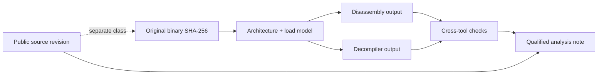

# Reverse-Engineering Artifact Classification

| Header field | Value |
| --- | --- |
| **Question** | How are original interpreter artifacts, released source, and analysis outputs classified so their evidential meaning cannot be conflated? |
| **Evidence scope** | P0 license/origin records; P1 checksums and reproducible analysis; P2 public derivative source behavior. |
| **Status** | implementation contract |
| **Implementation links** | [`../schemas/REVERSE_ENGINEERING_MANIFEST.md`](../schemas/REVERSE_ENGINEERING_MANIFEST.md), [`../interpreters/IDENTITY_PROTOCOL.md`](../interpreters/IDENTITY_PROTOCOL.md), [`../derivatives/README.md`](../derivatives/README.md) |
| **Non-claims** | Source availability, a matching name, successful compilation, or a decompiler output does not prove authorship, historical identity, or behavioral equivalence. |

## Canonical classes

| Class | Immutable/provenance requirement | Correct description | Never describe as |
| --- | --- | --- | --- |
| `original_binary` | Captured original bytes, SHA-256, source/acquisition metadata, and authorization state. | “Original binary candidate/exact profiled binary,” qualified by evidence. | “Source code.” |
| `public_original_source` | Public URL/revision/license and checksum/commit identity. | “Publicly released original source,” only when origin/license supports it. | “Complete source for all historical binaries.” |
| `public_derivative_source` | Public project/revision/license and derivative classification. | “Public derivative implementation source.” | “Original interpreter source.” |
| `disassembly` | `derived_from_sha256`, architecture/load model, assembler/disassembler version, command/config, output checksum. | “Tool-derived disassembly of `<sha256>`.” | “Recovered source.” |
| `decompilation` | Same derived fields plus decompiler language/pseudocode mode and known limitations. | “Tool-derived decompilation/pseudocode of `<sha256>`.” | “Original source code.” |
| `symbol_map` | Origin of each name: original symbol, imported metadata, inferred label, or analyst name. | “Annotated symbol map.” | “Author symbol table” unless directly sourced. |
| `analysis_note` | Claim-to-evidence links, author/date, tool/output references. | “Analyst hypothesis/finding.” | “Format specification” without independent evidence. |

## Source-to-derived lineage

## Naming discipline

Every derived artifact ID includes platform, architecture, original hash prefix, tool ID/version, and analysis mode. Analyst-invented labels use an `inferred_` prefix; imported public symbols identify their exact source. This enables later correction without rewriting history or implying that a tool’s control-flow reconstruction is authoritative.

## References

[1]: [Interpreter identity protocol](../interpreters/IDENTITY_PROTOCOL.md)
[2]: [Public implementation boundaries](../interpreters/PUBLIC_IMPLEMENTATIONS.md)
[3]: [Reverse-engineering manifest schema](../schemas/REVERSE_ENGINEERING_MANIFEST.md)
