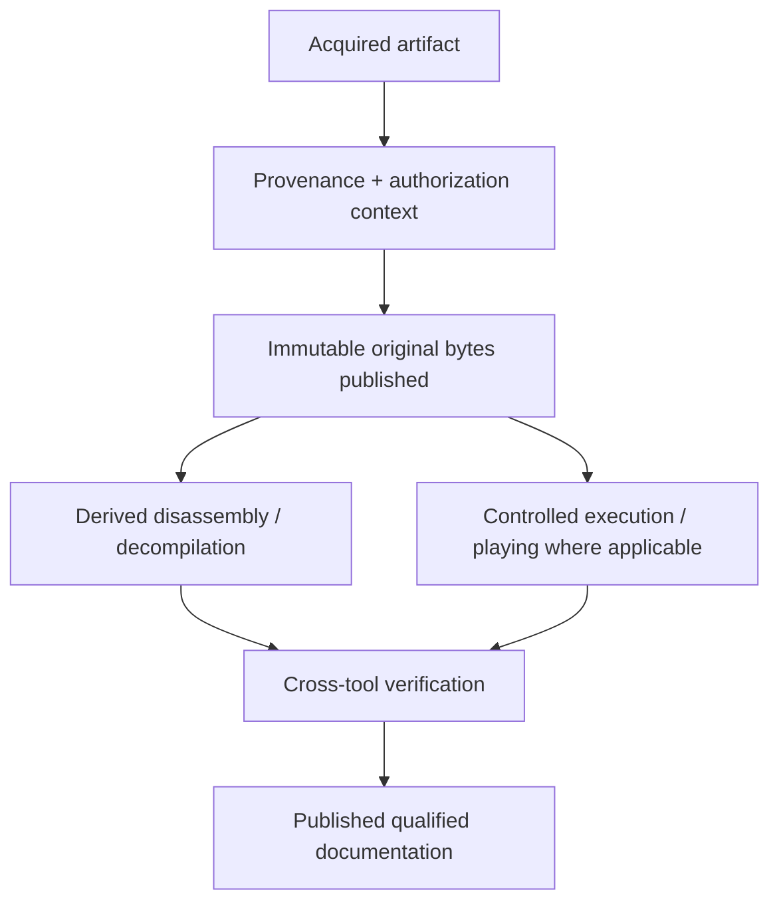

# Institutional Authorization and Corpus Handling

| Header field | Value |
| --- | --- |
| **Question** | How are retained original bytes and derived reverse-engineering materials handled while preserving scientific provenance and source-specific acquisition boundaries? |
| **Evidence scope** | Recorded institutional handling context; P0 source/license context; P1 acquisition hash, execution, and tool-run record. |
| **Status** | institutional handling context with source-specific direct-acquisition control |
| **Implementation links** | [`../schemas/REVERSE_ENGINEERING_MANIFEST.md`](../schemas/REVERSE_ENGINEERING_MANIFEST.md), [`../schemas/EVIDENCE_MODEL.md`](../schemas/EVIDENCE_MODEL.md), [`../SELF_CONTAINED_REGENERATION.md`](../SELF_CONTAINED_REGENERATION.md), [`../../TODO.md`](../../TODO.md) |
| **Non-claims** | An institutional statement or user claim does not authorize a new direct binary download, override a source’s terms, turn decompiler pseudocode into recovered source, prove an input’s historical identity, or remove the need for hashes, provenance, and independent verification. |

## Institutional handling context and direct-acquisition boundary

> **Recorded context, not a source authorization.** The repository may retain an institutional preservation directive as provenance context for already retained material and documented research handling. It does not establish independently verifiable permission for a new direct binary URL, bypass source-specific terms, or authorize automated acquisition, retention, or redistribution of material not already in the corpus.

Every new direct acquisition requires a durable source-specific basis linked to the exact release and URL: a public-license or official-free-download record, or a permission record from the relevant rights holder/source. A catalog entry, an institutional statement, a generic user claim, an accessible binary URL, or matching release metadata alone is insufficient. Candidates lacking that basis remain discovery records and are not queued for download.

Provenance fields remain mandatory because they make the corpus reproducible, explain source lineage, distinguish original from derived content, and permit independent scientific checking. Direct-acquisition authorization is an additional required boundary; it is never inferred from provenance completeness.

> **SELF-CONTAINED REGENERATION: REQUIRED.** Universal authorization permits retaining and using external emulators, decompilers, browsers, firmware, and validators, but it does not permit a promoted result to depend silently on one. Every primary derived claim must meet the [global self-contained regeneration standard](../SELF_CONTAINED_REGENERATION.md); external tools are documented acquisition methods or independent validators unless their behavior is reproduced by the repository-native command.

| Record class | Required retained evidence | Corpus outcome | Scientific boundary |
| --- | --- | --- | --- |
| Acquisition | Canonical URL/source, retrieval timestamp, SHA-256, platform/architecture, artifact class, and a source-specific authorization record before transfer. | Retain and publish immutable original bytes only after the direct-acquisition basis is independently recorded. | A filename, accessible URL, catalog listing, or institutional statement alone does not establish identity or download permission. |
| Authorization context | License text/URL, institutional directive reference if relevant, source scope, rights holder/issuer if known, and decision date. | Retain the context and state whether it authorizes the exact source. | Context status does not replace source-specific authorization, checksum, or source lineage. |
| Derivation | Original SHA-256, tool/version/container, load/memory model, exact command/configuration, and output hashes. | Retain and publish labelled disassembly/decompiler output. | Tool-generated output is not original/recovered source. |
| Verification | Independent check, execution trace, or explicit note that the check is pending. | Retain/publish both results and disagreements. | A single tool’s guess is not a settled historical fact. |
| Supporting runtime resource | Canonical source, retrieval timestamp, SHA-256, version, intended target/runtime role, and deterministic invocation. | Retain and publish ROMs, firmware, emulators, compilers, and configuration required to reproduce loader execution or game behavior. | A supporting resource does not establish the historical identity of a game artifact; its own provenance remains explicit. |

## Storage separation

Original bytes, public source, disassembly, decompiler output, symbols, and notes must be separate manifest nodes. Derived files retain a `derived_from_sha256` relation; they never overwrite, normalize, or obscure the original blob.

## Provenance-context states

| State | Meaning | Corpus behavior |
| --- | --- | --- |
| `institutional_authorized` | A recorded institutional preservation statement governs documented handling context. | Preserve as context for retained records; require a separate source-specific authorization before any new direct binary acquisition. |
| `public_license_verified` | A stable public license/source record explicitly describes the material. | Retain/publish; preserve the license as provenance context. |
| `permission_recorded` | A durable permission record identifies scope and issuer. | Retain/publish; preserve the permission context. |
| `user_claimed_permission` | The user reports permission but no separate durable record is retained. | Record as unverified context; do not use it as a direct-acquisition basis. |
| `analysis_only` | Earlier metadata described analysis-only scope. | Preserve the earlier description for history; do not use it as a direct-acquisition basis. |
| `unknown` | Source/rights context is incomplete. | Record the context as unknown rather than inventing it; do not queue a new direct binary acquisition. |

## References

[1]: [Research methodology](../RESEARCH_METHODOLOGY.md) "Evidence ladder and lawful reverse-engineering boundary"
[2]: [Evidence model](../schemas/EVIDENCE_MODEL.md) "Source, artifact, and derived-evidence relationships"
