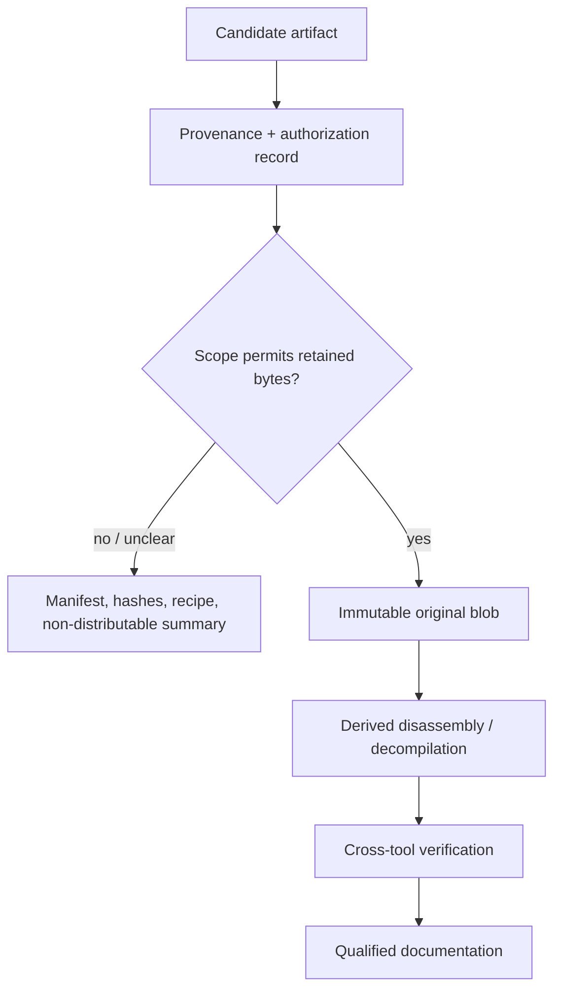

# Authorization and Handling Gate

| Header field | Value |
| --- | --- |
| **Question** | What must be recorded before an original interpreter binary or derived reverse-engineering artifact is stored or published by this repository? |
| **Evidence scope** | P0 license/authorization record and source URL; P1 acquisition hash/tool execution record. |
| **Status** | implementation contract |
| **Implementation links** | [`../schemas/REVERSE_ENGINEERING_MANIFEST.md`](../schemas/REVERSE_ENGINEERING_MANIFEST.md), [`../schemas/EVIDENCE_MODEL.md`](../schemas/EVIDENCE_MODEL.md), [`../../TODO.md`](../../TODO.md) |
| **Non-claims** | A user-reported permission, interoperability rationale, or public download location is not automatically a verified redistribution license or a universal right to publish every original/derived artifact. |

## Gate before acquisition and publication

The requested work is performed artifact-by-artifact. The repository records the user’s authorization claim as provenance, but publication decisions remain tied to a documented authorization or license whose scope covers the particular binary, source, or derivative file. When scope is absent or insufficiently recorded, the manifest may retain a checksum, metadata, tool recipe, and non-distributable analysis summary—but not the bytes in a public repository.

| Gate | Required retained evidence | Permitted repository outcome | Prohibited shortcut |
| --- | --- | --- | --- |
| Acquisition | Canonical URL/source, retrieval timestamp, SHA-256, platform/architecture, and artifact class. | Metadata and reproducibility record. | Calling a filename an original interpreter. |
| Authorization | License text/URL or durable permission record, scope, rights holder/issuer if known, and decision date. | Store/publish only within documented scope. | Treating “fair use” or a general claim as a publication grant. |
| Derivation | Original SHA-256, tool/version/container, load/memory model, exact command/configuration, and output hashes. | Disassembly/decompiler output labelled as derived. | Labelling pseudocode as original/recovered source. |
| Verification | At least one independent check or documented reason it is unavailable. | Promote bounded, qualified findings. | Presenting one tool’s guess as a settled fact. |

## Storage separation

Original bytes, public source, disassembly, decompiler output, symbols, and notes must be separate manifest nodes. Derived files retain a `derived_from_sha256` relation; they never overwrite, normalize, or obscure the original blob.

## Minimum authorization states

| State | Meaning | Default publication behavior |
| --- | --- | --- |
| `public_license_verified` | A stable public license/source record explicitly covers the material. | Store/publish only as that license permits. |
| `permission_recorded` | A durable permission record identifies scope and issuer. | Store/publish within the recorded scope. |
| `user_claimed_permission` | The user reports permission but no durable evidence is yet retained. | Do not publish original bytes; retain manifest/analysis metadata only. |
| `analysis_only` | Lawful local analysis may be claimed, but redistribution scope is absent. | Do not commit original bytes; publish bounded findings/recipes where appropriate. |
| `unknown` | No usable rights/provenance decision. | No acquisition-for-publication or redistribution. |

## References

[1]: [Research methodology](../RESEARCH_METHODOLOGY.md) "Evidence ladder and lawful reverse-engineering boundary"
[2]: [Evidence model](../schemas/EVIDENCE_MODEL.md) "Source, artifact, and derived-evidence relationships"
