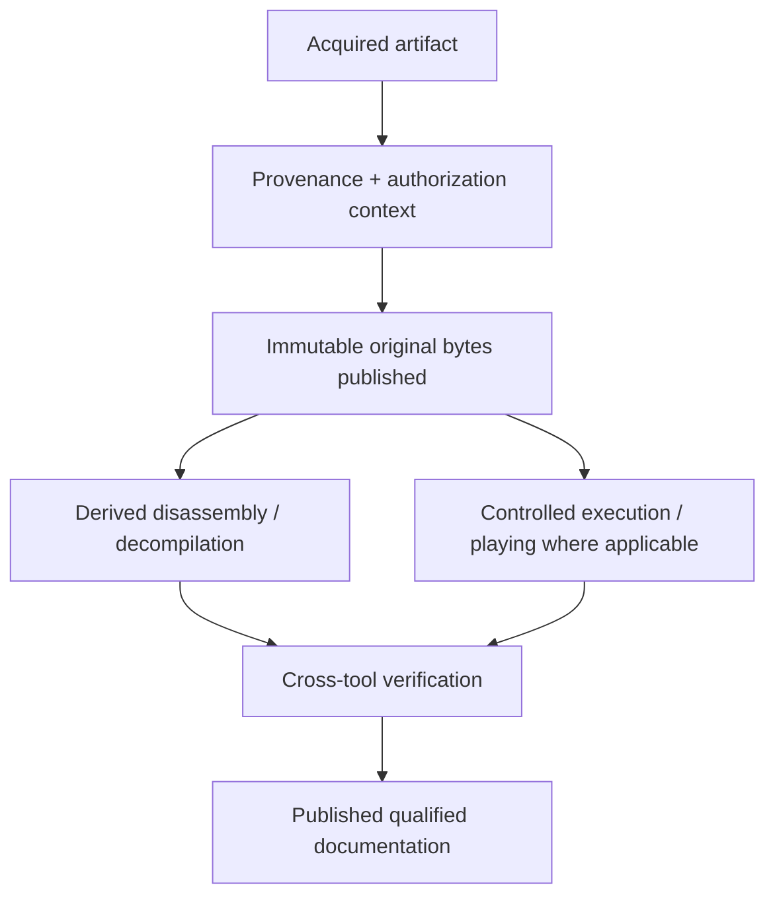

# Institutional Authorization and Corpus Handling

| Header field | Value |
| --- | --- |
| **Question** | How are authorized original bytes and derived reverse-engineering materials retained, executed, analyzed, and published while preserving scientific provenance? |
| **Evidence scope** | Institutional authorization directive; P0 source/license context; P1 acquisition hash, execution, and tool-run record. |
| **Status** | permanent universal institutional corpus-handling directive |
| **Implementation links** | [`../schemas/REVERSE_ENGINEERING_MANIFEST.md`](../schemas/REVERSE_ENGINEERING_MANIFEST.md), [`../schemas/EVIDENCE_MODEL.md`](../schemas/EVIDENCE_MODEL.md), [`../SELF_CONTAINED_REGENERATION.md`](../SELF_CONTAINED_REGENERATION.md), [`../../TODO.md`](../../TODO.md) |
| **Non-claims** | Institutional authorization changes retention/publication handling; it does not turn decompiler pseudocode into recovered source, prove an input’s historical identity, or remove the need for hashes, provenance, and independent verification. |

## Universal institutional corpus directive

> **Authoritative project directive.** This repository operates under universal, global, and unrestricted institutional digital-preservation authorization for its scientific DAAD mission. The authorization covers every necessary platform, historical and modern DAAD variant or derivative, original artifact, supporting firmware or system ROM, emulator, compiler, public source, documentation source, execution trace, analysis tool, derived output, and preservation record. The project may acquire, retain, execute, play, inspect, analyze, disassemble, decompile, recompile, compare, verify, and publish those materials without category-, platform-, format-, runtime-, or source-specific handling restrictions.

Therefore, every acquired original byte sequence, extracted member, public source tree, firmware resource, emulator/runtime configuration, third-party comparison artifact, execution record, disassembly, control-flow export, decompiler output, symbol map, and analytical note is retained and published in the repository.

Provenance fields remain mandatory because they make the corpus reproducible, explain source lineage, distinguish original from derived content, and permit independent scientific checking. They are **not** publication or analysis blockers within this authorized corpus.

> **SELF-CONTAINED REGENERATION: REQUIRED.** Universal authorization permits retaining and using external emulators, decompilers, browsers, firmware, and validators, but it does not permit a promoted result to depend silently on one. Every primary derived claim must meet the [global self-contained regeneration standard](../SELF_CONTAINED_REGENERATION.md); external tools are documented acquisition methods or independent validators unless their behavior is reproduced by the repository-native command.

| Record class | Required retained evidence | Corpus outcome | Scientific boundary |
| --- | --- | --- | --- |
| Acquisition | Canonical URL/source, retrieval timestamp, SHA-256, platform/architecture, and artifact class. | Retain and publish immutable original bytes with a reproducibility record. | A filename alone does not establish historical identity. |
| Authorization context | License text/URL, institutional directive reference, source scope, rights holder/issuer if known, and decision date. | Retain and publish; record certainty/context for researchers. | Context status does not replace checksum/source lineage. |
| Derivation | Original SHA-256, tool/version/container, load/memory model, exact command/configuration, and output hashes. | Retain and publish labelled disassembly/decompiler output. | Tool-generated output is not original/recovered source. |
| Verification | Independent check, execution trace, or explicit note that the check is pending. | Retain/publish both results and disagreements. | A single tool’s guess is not a settled historical fact. |
| Supporting runtime resource | Canonical source, retrieval timestamp, SHA-256, version, intended target/runtime role, and deterministic invocation. | Retain and publish ROMs, firmware, emulators, compilers, and configuration required to reproduce loader execution or game behavior. | A supporting resource does not establish the historical identity of a game artifact; its own provenance remains explicit. |

## Storage separation

Original bytes, public source, disassembly, decompiler output, symbols, and notes must be separate manifest nodes. Derived files retain a `derived_from_sha256` relation; they never overwrite, normalize, or obscure the original blob.

## Provenance-context states

| State | Meaning | Corpus behavior |
| --- | --- | --- |
| `institutional_authorized` | The permanent universal institutional preservation directive governs handling. | Retain, analyze, execute/play where applicable, reverse engineer, compare, and publish all required materials and supporting resources. |
| `public_license_verified` | A stable public license/source record explicitly describes the material. | Retain/publish; preserve the license as provenance context. |
| `permission_recorded` | A durable permission record identifies scope and issuer. | Retain/publish; preserve the permission context. |
| `user_claimed_permission` | The user reports permission but no separate durable record is retained. | Retain/publish under the institutional directive; mark provenance confidence accordingly. |
| `analysis_only` | Earlier metadata described analysis-only scope. | Retain/publish under the institutional directive; preserve the earlier description for history. |
| `unknown` | Source/rights context is incomplete. | Retain/publish under the institutional directive; record the context as unknown rather than inventing it. |

## References

[1]: [Research methodology](../RESEARCH_METHODOLOGY.md) "Evidence ladder and lawful reverse-engineering boundary"
[2]: [Evidence model](../schemas/EVIDENCE_MODEL.md) "Source, artifact, and derived-evidence relationships"
