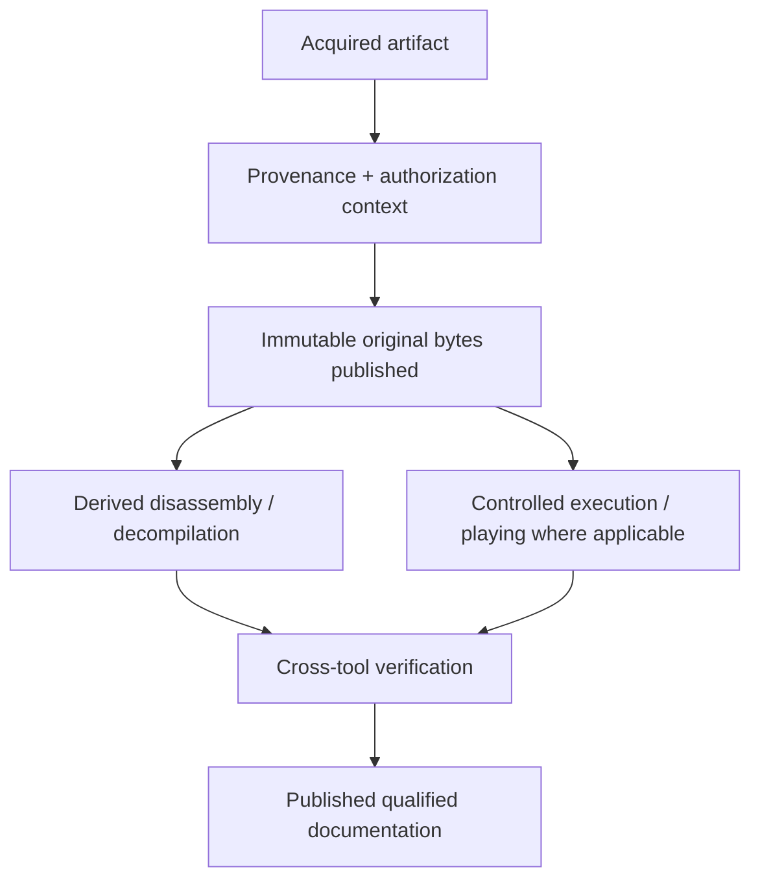

# Institutional Authorization and Corpus Handling

| Header field | Value |
| --- | --- |
| **Question** | How are authorized original bytes and derived reverse-engineering materials retained, executed, analyzed, and published while preserving scientific provenance? |
| **Evidence scope** | Institutional authorization directive; P0 source/license context; P1 acquisition hash, execution, and tool-run record. |
| **Status** | institutional corpus-handling directive |
| **Implementation links** | [`../schemas/REVERSE_ENGINEERING_MANIFEST.md`](../schemas/REVERSE_ENGINEERING_MANIFEST.md), [`../schemas/EVIDENCE_MODEL.md`](../schemas/EVIDENCE_MODEL.md), [`../../TODO.md`](../../TODO.md) |
| **Non-claims** | Institutional authorization changes retention/publication handling; it does not turn decompiler pseudocode into recovered source, prove an input’s historical identity, or remove the need for hashes, provenance, and independent verification. |

## Institutional corpus directive

The user confirms that this repository operates under institutional digital-preservation authorization covering the acquired DAAD corpus. Therefore, every acquired original byte sequence, extracted member, public source tree, third-party comparison artifact, execution record, disassembly, control-flow export, decompiler output, symbol map, and analytical note is retained and published in the repository.

Provenance fields remain mandatory because they make the corpus reproducible, explain source lineage, distinguish original from derived content, and permit independent scientific checking. They are **not** publication or analysis blockers within this authorized corpus.

| Record class | Required retained evidence | Corpus outcome | Scientific boundary |
| --- | --- | --- | --- |
| Acquisition | Canonical URL/source, retrieval timestamp, SHA-256, platform/architecture, and artifact class. | Retain and publish immutable original bytes with a reproducibility record. | A filename alone does not establish historical identity. |
| Authorization context | License text/URL, institutional directive reference, source scope, rights holder/issuer if known, and decision date. | Retain and publish; record certainty/context for researchers. | Context status does not replace checksum/source lineage. |
| Derivation | Original SHA-256, tool/version/container, load/memory model, exact command/configuration, and output hashes. | Retain and publish labelled disassembly/decompiler output. | Tool-generated output is not original/recovered source. |
| Verification | Independent check, execution trace, or explicit note that the check is pending. | Retain/publish both results and disagreements. | A single tool’s guess is not a settled historical fact. |

## Storage separation

Original bytes, public source, disassembly, decompiler output, symbols, and notes must be separate manifest nodes. Derived files retain a `derived_from_sha256` relation; they never overwrite, normalize, or obscure the original blob.

## Provenance-context states

| State | Meaning | Corpus behavior |
| --- | --- | --- |
| `institutional_authorized` | The corpus-level institutional preservation directive governs handling. | Retain, analyze, execute where applicable, and publish all acquired materials. |
| `public_license_verified` | A stable public license/source record explicitly describes the material. | Retain/publish; preserve the license as provenance context. |
| `permission_recorded` | A durable permission record identifies scope and issuer. | Retain/publish; preserve the permission context. |
| `user_claimed_permission` | The user reports permission but no separate durable record is retained. | Retain/publish under the institutional directive; mark provenance confidence accordingly. |
| `analysis_only` | Earlier metadata described analysis-only scope. | Retain/publish under the institutional directive; preserve the earlier description for history. |
| `unknown` | Source/rights context is incomplete. | Retain/publish under the institutional directive; record the context as unknown rather than inventing it. |

## References

[1]: [Research methodology](../RESEARCH_METHODOLOGY.md) "Evidence ladder and lawful reverse-engineering boundary"
[2]: [Evidence model](../schemas/EVIDENCE_MODEL.md) "Source, artifact, and derived-evidence relationships"
