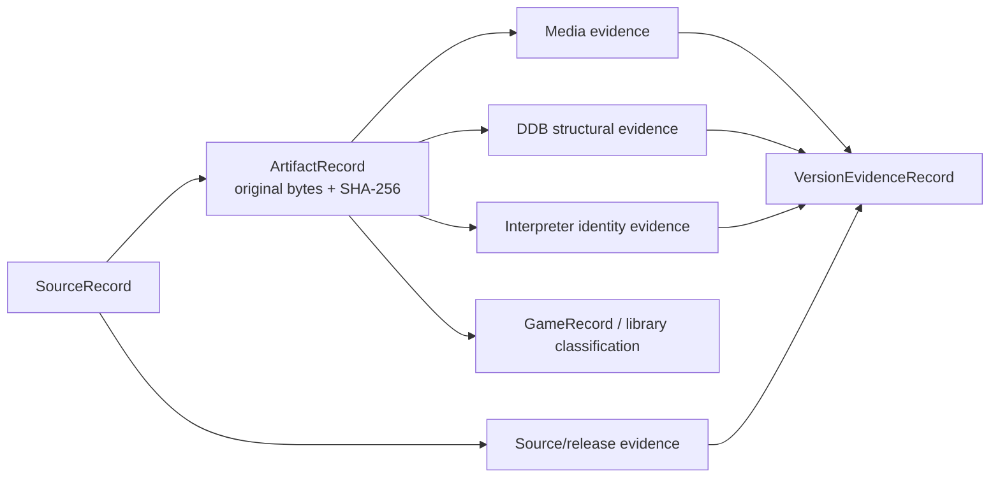

# Preservation Evidence Model

| Header field | Value |
| --- | --- |
| **Question** | How are sources, artifacts, media observations, DDB measurements, runtime identities, and version claims represented without collapsing their evidence? |
| **Evidence scope** | P0–P4 according to [`../RESEARCH_METHODOLOGY.md`](../RESEARCH_METHODOLOGY.md); persisted values are P1 only when derived from reproducible measurement that satisfies the global [`../SELF_CONTAINED_REGENERATION.md`](../SELF_CONTAINED_REGENERATION.md) policy. |
| **Status** | implementation contract |
| **Implementation links** | [`../../daad_harvester/models.py`](../../daad_harvester/models.py), [`../../daad_harvester/db.py`](../../daad_harvester/db.py), [`../../daad_harvester/fingerprint.py`](../../daad_harvester/fingerprint.py), [`../../daad_harvester/provenance.py`](../../daad_harvester/provenance.py) |
| **Non-claims** | A relation in this model does not grant a claim a higher confidence than its independently recorded evidence permits. |

## Core entities

| Entity | Persistent identity | What it records | What it must not imply |
| --- | --- | --- | --- |
| `SourceRecord` | Source URL and database ID. | Discovery/acquisition metadata, source tier/status, release/toolchain/provenance assertions. | Truth of an unverified source assertion. |
| `ArtifactRecord` | SHA-256 plus database ID and parent source. | Original member name, archive depth, hashes, DDB/runtime/media fields. | A game title or release identity merely from its location. |
| `VersionEvidenceRecord` | Kind/value/confidence with optional source/artifact reference. | One independently reviewable claim and structured details. | A replacement for the bytes or source it cites. |
| Media evidence JSON | Artifact-associated parser/status/validation/details. | Container recognition, structural validation, member/track/block provenance. | Semantic extraction when status is evidence-only. |
| Fingerprint evidence JSON | Artifact-associated DDB/parser/runtime-match details. | Header/process measurement, wrapper, embedded offset, candidate runtimes. | Universal compatibility or release lineage. |
| `GameRecord` | Game ID linked to artifact. | Classified result suitable for library/detection workflows. | A fabricated game identity when evidence is absent. |

## Relationship rules

The source is the acquisition/provenance parent. An artifact is the immutable byte observation. A parser may add media evidence; a DDB parser may add structural evidence; an interpreter profile may add binary identity evidence. Each result remains independently inspectable and may disagree without overwriting the source bytes.

The standalone version of this model is [`../diagrams/RESEARCH_EVIDENCE_FLOW.mmd`](../diagrams/RESEARCH_EVIDENCE_FLOW.mmd).

## Confidence and grade mapping

| Layer | Value family | Meaning | Upgrade condition |
| --- | --- | --- | --- |
| Research grade | P0–P4 | Source/method reliability under the research methodology. | Add a stronger source or reproducible measurement; preserve earlier record. |
| Runtime confidence | `verified`, `strong`, `candidate`, `none`. | Exact hash, filename/bundle, contextual, or no identity evidence. | Exact same-platform profile hash only upgrades to `verified`. |
| DDB result | `verified` / `unverified` structural result. | Target-aware header/pointer/process/bytecode validation succeeded or did not. | Pass the parser contract; it remains independent of runtime confidence. |
| Media status | Extracted, recognized evidence, rejected, or unavailable parser result. | What the media adapter safely established. | A later decoder adds a new relation; it does not erase original media evidence. |

## Immutability and provenance

`original_filename`, source relation, archive depth, and hashes preserve chain-of-custody context. Local extraction paths are operational values and must not be published in the static report. Derived objects retain parent SHA-256, parser identity/version, extraction depth, and block/sector/member location where applicable.[1]

## Self-contained regeneration metadata

> **SELF-CONTAINED REGENERATION: REQUIRED.** A P1 structural measurement, generated evidence report, reverse-engineering output, or promoted library classification must resolve to a manifest entry satisfying the global [self-contained regeneration standard](../SELF_CONTAINED_REGENERATION.md).

| Field | Required primary-path value | Boundary enforced |
| --- | --- | --- |
| `regeneration_manifest_id` | Stable entry ID in `preservation_corpus/regeneration_manifest.json`. | The claim is discoverable as a deterministic computation rather than an opaque file. |
| `input_sha256` | Hashes for every committed source, fixture, capture, and configuration read by the command. | A changed input cannot silently preserve a result label. |
| `native_command` | Repository-local, network-free command using declared dependencies only. | A GUI tool, host executable, browser session, or remote endpoint cannot become a hidden requirement. |
| `output_sha256` | Exact output hash or byte-comparison target asserted by CI. | The regenerated result must match the retained evidence. |
| `external_validators` | Explicit list, including `[]` when absent, with tool/version/role. | Independent applications may corroborate but cannot become the primary regeneration path. |

An emulator-produced RAM snapshot may be a hash-pinned immutable input when live emulation acquired it, but the promoted downstream measurement must execute from that committed snapshot through a repository-native parser/verifier. Live emulation remains acquisition evidence, not a future regeneration prerequisite.

## References

[1]: [`models.py`](../../daad_harvester/models.py), [`fingerprint.py`](../../daad_harvester/fingerprint.py), and [`report_export.py`](../../daad_harvester/report_export.py) in Harvester
