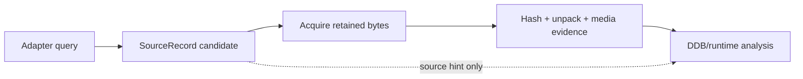

# Discovery Adapter Sources Ledger

| Header field | Value |
| --- | --- |
| **Question** | Which public sources does Harvester query for candidate discovery, and what evidence may each result legitimately contribute? |
| **Evidence scope** | Discovery results are source/provenance leads. Artifact identity and DDB/runtime claims require retained bytes plus independent P0/P1 validation. |
| **Status** | implementation contract |
| **Implementation links** | [`../../daad_harvester/discover.py`](../../daad_harvester/discover.py), [`../../daad_harvester/models.py`](../../daad_harvester/models.py) |
| **Non-claims** | A search hit, platform badge, web page, filename, or metadata record is never proof that a downloadable object is DAAD, complete, safe to extract, or associated with a particular interpreter version. |

## Adapter inventory

| Adapter/source | Endpoint or source family | Candidate role | Platform hint policy | Preservation boundary |
| --- | --- | --- | --- | --- |
| Canonical seeds | Maintained project seed configuration. | Repeatable first-party/curated starting URLs. | Only explicitly declared seed metadata. | Still fetch, hash, parse, and retain provenance. |
| Internet Archive | Advanced Search and item download endpoints.[1] | Archive metadata plus direct candidate members. | Map metadata only when platform markers are unambiguous. | Item metadata is not file-level DDB/runtime verification. |
| Aminet | DAAD query page.[2] | Amiga candidate package discovery. | `amiga` as a source-context hint. | Package/member bytes require normal extraction and analysis. |
| CSDb | DAAD search.[3] | Commodore 64 candidate discovery. | `c64` source-context hint only. | Do not infer Plus/4/C64 runtime identity from site context. |
| Plus/4 World | DAAD notes search.[4] | Plus/4 candidate discovery. | `plus4` source-context hint. | Download/member evidence remains independent. |
| Generation MSX | Aventuras AD company catalog.[5] | Non-fetchable MSX catalog/provenance evidence. | `msx` catalog context. | Catalog listing does not imply a retrievable artifact or runtime hash. |
| Computer Emuzone | DAAD engine index.[6] | Game/release page discovery and platform badge evidence. | Record parsed badge as provenance, not verified target identity. | Direct downloads still need full acquisition and parser path. |
| Atarimania | Curated Atari ST pages.[7] | Targeted Atari ST candidate provenance. | `atarist` context from curated list/page. | No protected-media or interpreter conclusion from page text alone. |
| GitHub | Repository Search API.[8] | Public source/repository leads and lawful derivative discovery. | None unless repository material independently states it. | Repository name/readme is not a game artifact. |
| itch.io | Tag listing pages.[9] | Contemporary DAAD-related release discovery. | Parse multiple declared platforms; leave ambiguous result unset. | Page/platform labels remain source claims. |
| IFDB | Tag search XML.[10] | Interactive-fiction catalog lead discovery. | No direct canonical platform inference. | Catalog entry is not downloadable-media evidence. |
| ZXDB / ZXInfo | ZXInfo Search API.[11] | Spectrum candidate file/catalog discovery. | `zx` only where returned/source context supports it. | Result attachment still requires download/hash/parser evidence. |
| wikiCAAD | MediaWiki search API.[12] | Spanish-language historical catalog/provenance pages. | No automatic platform assignment from a page title. | Wiki prose is P3 unless backed by retained primary evidence. |
| World of Spectrum | Aventuras AD publisher archive.[13] | Spectrum archive candidate discovery. | `zx` source context. | Archive page does not replace tape/snapshot/media parsing. |
| IF Archive | IF-archive index/path leads.[14] | General interactive-fiction archive discovery. | No automatic target assignment. | Retain download path/URL and validate the retrieved member. |
| Web search | DuckDuckGo HTML results.[15] | Last-resort lead expansion. | None. | Snippets are never citations or verification evidence. |

## Adapter result protocol

Every candidate source record stores canonical URL, source tier/status, original title where available, source name/role, optional platform/year/language/release/toolchain hints, and serialized provenance. The acquisition phase independently records HTTP/media details and creates artifacts only from obtained bytes. The fingerprint phase then separately evaluates DDB structure and interpreter neighbors.[16]

## Operational constraints

Adapters are rate-limited and failures are logged as source-state outcomes. A source can be unavailable, blocked, metadata-only, non-downloadable, or legally unsuitable for redistribution without invalidating the underlying historical claim. The report must preserve that distinction rather than silently substituting another archive copy.

## References

[1]: https://archive.org/advancedsearch.php "Internet Archive Advanced Search"
[2]: https://aminet.net/search?query=daad "Aminet DAAD search"
[3]: https://csdb.dk/search/?search=daad "CSDb DAAD search"
[4]: https://plus4world.powweb.com/search/notes/DAAD "Plus/4 World DAAD search"
[5]: https://www.generation-msx.nl/company/aventuras-ad/292/software/ "Generation MSX Aventuras AD catalog"
[6]: https://computeremuzone.com/engine/daad?l=en "Computer Emuzone DAAD engine index"
[7]: https://www.atarimania.com/ "Atarimania"
[8]: https://docs.github.com/en/rest/search/search "GitHub Search API"
[9]: https://itch.io/ "itch.io"
[10]: https://ifdb.org/ "Interactive Fiction Database"
[11]: https://api.zxinfo.dk/v3/search "ZXInfo Search API"
[12]: https://wiki.caad.es/api.php "wikiCAAD MediaWiki API"
[13]: https://worldofspectrum.org/archive/publishers/Aventuras-AD-SA "World of Spectrum Aventuras AD archive"
[14]: https://www.ifarchive.org/ "Interactive Fiction Archive"
[15]: https://html.duckduckgo.com/html/ "DuckDuckGo HTML search"
[16]: [`discover.py`](../../daad_harvester/discover.py) "Harvester discovery adapter implementation"
