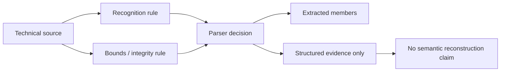

# Media Specification Sources Ledger

| Header field | Value |
| --- | --- |
| **Question** | Which technical source governs a media-family claim, and what part of a parser/preservation decision may it justify? |
| **Evidence scope** | P0/P3 technical documentation, upgraded to P1 only when a retained fixture independently reproduces the stated behavior. |
| **Status** | source-backed |
| **Implementation links** | [`../../daad_harvester/media_inspection.py`](../../daad_harvester/media_inspection.py), [`../formats/README.md`](../formats/README.md) |
| **Non-claims** | A source that establishes a magic value or container family does not automatically establish semantic decoding of protected, custom-loader, encrypted, or undocumented content. |

| ID | Media family | Source | Supported technical claim | Preservation boundary |
| --- | --- | --- | --- | --- |
| `TZX-1.20` | TZX and CPC CDT | TZX format specification; CPC CDT reference.[1] | Standard header/block families, declared lengths, control/metadata distinction, CDT’s TZX-derived representation. | A recognized timing/control block is retained even when platform-specific payload reconstruction is unavailable. |
| `VICE-CBM` | CBM TAP, G64, disk/program wrappers | VICE file-format reference.[2] | C64/C16/Plus/4 media identity distinctions and low-level media-family separation. | GCR/pulse media must not be mislabeled as filesystem members. |
| `CPM-AMSTRAD` | CPC, PCW, +3DOS CP/M media | Amstrad CP/M disc-format reference.[3] | XDPB-related geometry, CPC and PCW/+3 detection rules, layout parameters. | Container geometry and in-media profile must be validated before CP/M extent traversal. |
| `ADF-FAQ` | ADF and AmigaDOS volume layer | ADF format FAQ.[4] | Sector-dump model, big-endian fields, boot/root/file/directory block concepts. | Raw ADF identity is distinct from validated OFS/FFS extraction. |
| `XDMS` | DMS | xDMS Rust reference implementation.[5] | DMS track framing and complete compression-mode oracle behavior. | Encrypted or integrity-invalid tracks remain evidence, not partial ADF output. |
| `STX` | Atari protected media | STX preservation reference and linked technical sources.[6] | STX/Pasti protected-media classification and `RSY` signature. | Recognition alone does not permit protected-sector reconstruction. |

## Citation protocol

A detailed `formats/` module cites only the rows it uses. The citation must name whether it supports **recognition**, **bounds**, **integrity**, **extraction**, or **evidence-only preservation**. If a source does not define a behavior, the document either cites a reproducible fixture or declares the gap.

## References

[1]: https://worldofspectrum.net/TZXformat.html "TZX format specification"; https://cpctech.cpcwiki.de/docs/cdt.html "CDT format specification"
[2]: https://vice-emu.sourceforge.io/vice_17.html "VICE emulator file-format reference"
[3]: https://www.seasip.info/Cpm/amsform.html "Amstrad CP/M disc formats"
[4]: http://lclevy.free.fr/adflib/adf_info.html "The .ADF (Amiga Disk File) format FAQ"
[5]: https://github.com/mlund/xdms-rs "xDMS Rust reference implementation"
[6]: http://justsolve.archiveteam.org/wiki/STX "STX preservation-format reference"
