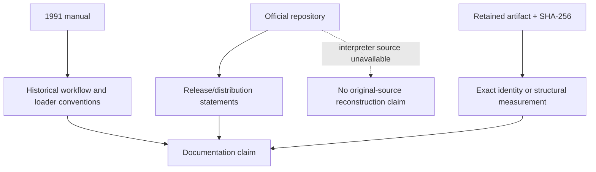

# Primary DAAD Sources Ledger

| Header field | Value |
| --- | --- |
| **Question** | Which publicly available first-party or contemporaneous DAAD materials can support historical, structural, and preservation claims? |
| **Evidence scope** | P0 primary source and P1 reproducible measurement. |
| **Status** | source-backed |
| **Implementation links** | [`../../daad_harvester/interpreter_profiles.py`](../../daad_harvester/interpreter_profiles.py), [`../versions/RELEASE_LINEAGE.md`](../versions/RELEASE_LINEAGE.md) |
| **Non-claims** | Availability of public DAAD distribution material does **not** imply publication of the original interpreter source code, completeness of every historical release, or license to redistribute recovered proprietary binaries. |

## Source records

| ID | Source and access class | Supported claims | Explicit boundary | Consumed by |
| --- | --- | --- | --- | --- |
| `DAAD-OFFICIAL-REPO` | Official public repository.[1] | Current public distribution identifies DAAD as a multi-machine adventure writer; the tree publishes docs/release material and points to DRC. | The legal notice says original interpreter sources are not currently provided. | Versions, interpreters, derivatives, source policy. |
| `DAAD-1991-MANUAL` | Public copy of the 1991 DAAD manual carried in the MSX2DAAD documentation tree.[2] | Historical compiler-to-DDB workflow; contemporary target-side resource sets; loader/interpreter naming conventions. | It is a historical manual, not a hash authority for a surviving binary and not a DDB byte-layout oracle unless it explicitly defines the relevant bytes. | Release lineage, platform dossiers, interpreter identity protocol. |
| `DAAD-OFFICIAL-RELEASES` | Releases in the official repository.[1] | Published current release labels and repository revision provenance. | A release label does not identify a game artifact or establish that every historical platform runtime has the same implementation. | Release lineage. |

## Claim routing

The official repository’s legal notice is a preservation boundary, not a gap to be hidden. Original interpreter behavior may be discussed only through a cited manual statement, observable artifact measurement, or a clearly scoped compatibility study. A named file such as `DPCWIl.Z80`, `lDIn.PRG`, or a `PARTx.DDB` companion is historical workflow context; the exact runtime identity requires its own P1 hash/profile evidence.

## Reproducibility requirements

When this ledger supports a measurement, record the repository revision or manual copy hash, retrieval time, original URL, artifact SHA-256, tool revision, and the specific line/table/section that supports the claim. The source must remain distinguishable from Harvester’s implementation decision.

## References

[1]: https://github.com/daad-adventure-writer/daad "Official DAAD repository"
[2]: https://github.com/nataliapc/msx2daad/blob/master/docs/DAAD_Manual_1991.md "Public copy of the 1991 DAAD manual"
