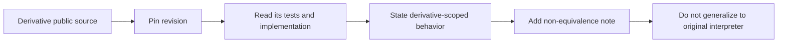

# Public Implementations Ledger

| Header field | Value |
| --- | --- |
| **Question** | Which public implementations may be analyzed as source code, and what is the strict scope of each resulting claim? |
| **Evidence scope** | P0 for the project’s own stated behavior and license; P2 for derivative compatibility behavior. |
| **Status** | source-backed |
| **Implementation links** | [`../../daad_harvester/fingerprint.py`](../../daad_harvester/fingerprint.py), [`../derivatives/README.md`](../derivatives/README.md) |
| **Non-claims** | No open derivative source automatically proves behavior of a proprietary original interpreter or a differently revised derivative. |

## Project records

| ID | Project | Source status | What its maintained public material supports | What it cannot establish |
| --- | --- | --- | --- | --- |
| `DRC-SOURCE` | DAAD Reborn Compiler (DRC). | GPL-3.0 public repository.[1] | A modern replacement compiler, its declared host environments/targets, source-level output rules at a pinned revision, and its own helper tools. | Exact behavior of original DC for unmeasured historical inputs. |
| `MSX2DAAD-SOURCE` | MSX2DAAD. | Public source and project license statement.[2] | Source-level MSX2/MSX2+ runtime behavior, release history, tests, and implementation-specific V2/V3 compatibility logic. | Original MSX runtime internals or all historical DDB behavior. |
| `DAAD-READY-MANUAL` | DAAD Ready. | Maintainer-published manual.[3] | DSF text-source workflow, package orchestration around DRC/interpreters, stated target packaging, and its documented language limitations. | An original DAAD manual or authoritative original interpreter specification. |
| `ADP-SOURCE` | ADP — ADventure Player. | MIT public source, pinned at `379a6710de11a2378f3d76c25a4d71bca75073bf`, plus every beta-0.1 to beta-0.3 release asset.[4] | Its own portable DAAD-player/toolchain behavior, stated V1/V2/V3 scope, experimental 8-bit support, native DOS/Amiga/ST ports, tools, source tests, and retained release artifacts. | Historical original-interpreter source, byte identity, or behavior of games that have not been measured against ADP and original evidence. |

## Revision pinning policy

Source-led claims require a commit identifier. The audit workspace records the inspected DRC revision as `e7bb170ef94e7b4965c0719b497638cec7aeaca9` and the ADP revision as `379a6710de11a2378f3d76c25a4d71bca75073bf`; the documentation must cite an immutable revision when a claim depends on code rather than a project-level README.

## Use protocol

For DRC, documentation may describe the target-selection table, wrapper-header options, output address policy, and code-generation behavior only as **DRC behavior**. For MSX2DAAD, it may cite source-level DDB validation/dispatch behavior as **MSX2DAAD behavior**. For DAAD Ready, it may cite tool workflow and package composition as **DAAD Ready behavior**. For ADP, it may cite its stated player/toolchain scope, source-level behavior, published release assets, and retained host-test result only as **ADP behavior**. A future clean-room interpreter can compare these sources with P0 manuals and P1 artifacts, but must preserve disagreement rather than “average” implementations.

## References

[1]: https://github.com/Utodev/DRC "DAAD Reborn Compiler public repository"
[2]: https://github.com/nataliapc/msx2daad "MSX2DAAD public repository"
[3]: https://www.ngpaws.com/daadready/doc_en.html "DAAD Ready English manual"
[4]: https://github.com/jlcebrian/ADP/tree/379a6710de11a2378f3d76c25a4d71bca75073bf "ADP pinned public repository"
