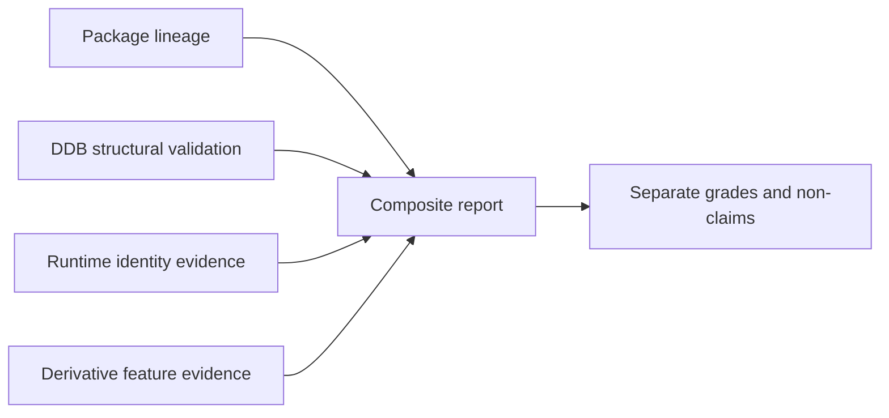

# Compatibility Boundaries for DAAD Version Claims

| Header field | Value |
| --- | --- |
| **Question** | Which DAAD version/compatibility claims transfer across artifact, compiler, runtime, and derivative evidence—and which do not? |
| **Evidence scope** | P0 public release/source statements; P1 reproducible structural measurement; P2 public derivative source; P3/P4 only with explicit grade. |
| **Status** | implementation contract |
| **Implementation links** | [`../../daad_harvester/fingerprint.py`](../../daad_harvester/fingerprint.py), [`../../daad_harvester/interpreter_profiles.py`](../../daad_harvester/interpreter_profiles.py), [`../interpreters/IDENTITY_PROTOCOL.md`](../interpreters/IDENTITY_PROTOCOL.md) |
| **Non-claims** | Shared names, file extensions, platform labels, or successful execution in one derivative do not establish cross-implementation equivalence. |

## Five independent propositions

Preservation reports must maintain five separate propositions. A stronger statement may be issued only when its own evidence condition is met; no row automatically upgrades another.

| Proposition | Minimum evidence | Does not transfer to |
| --- | --- | --- |
| Release/package lineage | Official release material plus captured manifest/member provenance. | DDB structure, runtime identity, or game publication origin. |
| DDB generation | P1 successful bounded structural validation. | Exact compiler, original release, or full runtime compatibility. |
| Compiler-output affinity | A documented compiler contract plus a matching measured structure. | Executable/runtime identity. |
| Runtime identity | Exact SHA-256 against a pinned, provenance-qualified profile. | Adjacent DDB identity or all-feature compatibility. |
| Derivative feature compatibility | The derivative’s own source/manual and a feature-scoped test or declaration. | Original-interpreter semantics or another derivative’s behavior. |

## Transfer matrix

| From evidence | May support | Must not be promoted to |
| --- | --- | --- |
| DRC header target/language byte | DRC-compatible target/language interpretation. | Official target interpreter or historical release. |
| Exact official interpreter hash | Identity of the specific captured runtime file. | The version of a neighboring DDB. |
| Original filename in a retained bundle | Strong runtime-family neighbor evidence. | Exact binary identity. |
| PCDAAD/MSX2DAAD source claim | Named derivative compatibility behavior. | Original DAAD compatibility behavior. |
| Maluva resource/call pattern | Extension candidate with provenance. | DDB generation or working extension on every target. |
| UnDAAD-derived output | Tool-derived auxiliary representation within its stated scope. | Recovered source or normative format specification. |

## Claim composition rule

The most useful reports combine independent, qualified evidence rather than creating one overconfident label. For example: “Measured DRC-compatible V3 DDB structure (`target=CPC`); runtime neighbor named `DAAD.BIN` has no exact official profile; extension companion asset indicates a Maluva candidate.” This is more actionable to a future ScummVM implementer than “CPC DAAD V3.”

## Escalation and downgrade rules

An exact-hash mismatch downgrades a runtime claim to a neighbor/name observation; it does not invalidate the DDB. A structural parser failure downgrades only the layout claim; it does not erase preserved bytes or media evidence. A derivative compatibility test may reveal a missing condact, but it does not prove corruption until the documented contract and original media have been independently evaluated.[1] [2]

## References

[1]: [DRC compiler contract](DDB_GENERATIONS.md)
[2]: [Derivative index](../derivatives/README.md); [interpreter identity protocol](../interpreters/IDENTITY_PROTOCOL.md)
