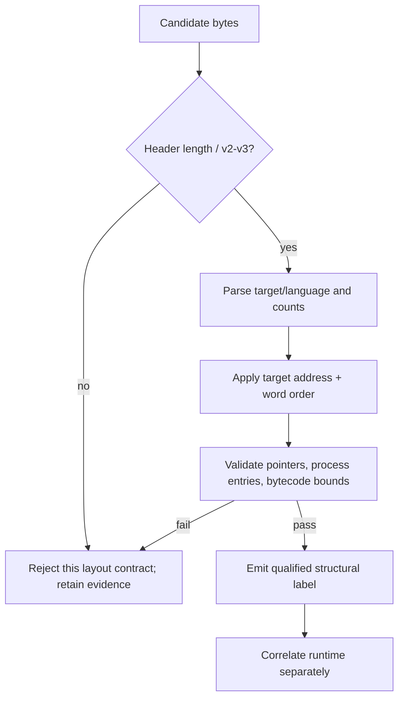

# DDB Generations and DRC Header Contract

| Header field | Value |
| --- | --- |
| **Question** | Which DDB-generation fields are structurally measurable, and what exact compiler-specific header contract is public? |
| **Evidence scope** | P0 public DRC source; P1 Harvester structural-parser measurement and retained fixtures. |
| **Status** | implementation contract |
| **Implementation links** | [`../../daad_harvester/fingerprint.py`](../../daad_harvester/fingerprint.py), [`../../daad_harvester/models.py`](../../daad_harvester/models.py), [`DDB_STRUCTURAL_FIELDS.md`](../schemas/DDB_STRUCTURAL_FIELDS.md) |
| **Non-claims** | A successful layout parse does not identify the authoring release, original interpreter binary, game title, or cross-runtime feature completeness. |

## Generation vocabulary

Harvester distinguishes a **measured layout family** from a release label. The existing parser uses historical compact V1/V2 labels for bounded legacy structures and DRC-compatible V2/V3 labels for structures consistent with the public compiler contract. These labels describe the data relationship evidenced by bytes; they must never be inflated into a historical product-release claim.[1]

| Structural label | Core evidence | Allowed output wording | Disallowed shortcut |
| --- | --- | --- | --- |
| `daad-v1-legacy` / `daad-v2-legacy` | Bounded legacy header, counts, offsets, and terminators validate. | “Measured historical compact layout candidate.” | “Proven original Rn database.” |
| `daad-v2` / `daad-v3` | DRC-compatible header, address/pointer/endian rules, process entries, and bytecode bounds validate. | “Measured DRC-compatible DDB v2/v3 structure.” | “Runs on every DRC/original interpreter.” |
| rejected | A required bound, count, pointer, or terminator fails. | “Candidate DDB did not validate under this parser contract.” | “Not a DAAD artifact.” |

## Public DRC header sequence

The retained public DRC revision `e7bb170` writes the initial header sequence shown below. The table is **a DRC compiler contract**. It can support reproducible comparison with compiler output, but the same bytes in an unproven file do not prove its producer.[2]

| Offset | DRC write | Measured interpretation | Constraint / caveat |
| --- | --- | --- | --- |
| `0x00` | Version byte `2` or `3` | DRC V2/V3 layout discriminator. | Validate together with the full bounded structure. |
| `0x01` | Machine ID shifted into high nibble; language low-bit set for Spanish/Portuguese. | Target/language byte. | English and German leave the low bit clear in this source; its zero value is not a unique English proof. |
| `0x02` | Null-character value, normally underscore (`0x5F`); MSX2 reuses it for subtarget information. | Historic control/subtarget field. | Do not require `0x5F` for documented MSX2 output. |
| `0x03`–`0x07` | Object, location, user-message, system-message, and process counts. | Count fields used by structural validation. | Counts must be combined with table/pointer bounds. |
| `0x08`–`0x21` | Initially reserved/zero-filled header region before later offset updates. | Header continuation. | Field-level semantics require parser/schema evidence, not the initial fill alone. |
| `0x22` onward | 13 external vectors written as target-endian words. | Extension-vector region. | Word endianness follows DRC target logic, below. |

## DRC machine-ID table

The following is a direct transcription of `getMachineIDByTarget()` for the canonical DAAD targets and adjacent documented DRC targets.[2]

| DRC target | ID before shift | Header high nibble | Canonical Harvester platform | Note |
| --- | ---: | ---: | --- | --- |
| `PC` | `0x00` | `0x0` | `dos` | `PC` + `VGA256` is an explicit exception below. |
| `ZX` | `0x01` | `0x1` | `zx` | Subtargets include multiple ZX deployment choices. |
| `C64` | `0x02` | `0x2` | `c64` | — |
| `CPC` | `0x03` | `0x3` | `cpc` | — |
| `MSX` | `0x04` | `0x4` | `msx` | — |
| `ST` | `0x05` | `0x5` | `atarist` | — |
| `AMIGA` | `0x06` | `0x6` | `amiga` | — |
| `PCW` | `0x07` | `0x7` | `pcw` | — |
| `CP4` | `0x0E` | `0xE` | `plus4` | CP4 denotes Commodore Plus/4. |
| `MSX2` | `0x0F` | `0xF` | `msx` | DRC-specific MSX2 target, not a general MSX identity proof. |
| `CPM` | `0x0B` | `0xB` | — | CP/M compiler target, not one of the nine canonical runtime labels. |
| `PC` + `VGA256`; `HTML` | `0x0D` | `0xD` | `dos`; derivative/web | Explicit DRC exception for PCDAAD VGA256/jDAAD-style output. |

## Target address and word-order contract

`getBaseAddressByTarget()` returns the following defaults unless a forced base address is supplied. `isLittleEndianPlatform()` returns true only for `ST` and `AMIGA`; therefore this is an output-rule table, not a universal statement about every file encountered on those platforms.[2]

| Canonical target | DRC default base address | DRC external-vector word order | Report rule |
| --- | ---: | --- | --- |
| ZX | `0x8400` | Big-endian | Treat a different measured base as possible forced/other output, not automatic rejection. |
| CPC | `0x2880` | Big-endian | Validate target-specific pointer range. |
| C64 | `0x3880` | Big-endian | Keep any Commodore wrapper separate from the DDB body. |
| Plus/4 (`CP4`) | `0x7080` | Big-endian | Apply CP4 target contract only after target-byte evidence. |
| MSX | `0x0100` | Big-endian | MSX2 subtarget behavior is separate. |
| PCW | `0x0100` | Big-endian | CP/M media provenance is separate from DDB fields. |
| DOS (`PC`) | `0x0000` | Big-endian | `0` is the source default; it is not an address proof for arbitrary DOS files. |
| Atari ST | `0x0000` | Little-endian | DRC-specific endian rule. |
| Amiga | `0x0000` | Little-endian | DRC-specific endian rule. |

## Validation sequence

## References

[1]: [DAAD chronology migration source](DAAD_CHRONOLOGY.md) and [`fingerprint.py`](../../daad_harvester/fingerprint.py) structural-label implementation
[2]: https://github.com/daad-adventure-writer/daad/blob/e7bb170/src/drb.php "DRC `drb.php` header-writing, machine-ID, base-address, and endianness logic"
