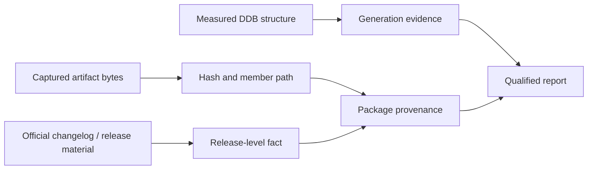

# DAAD Release Lineage

| Header field | Value |
| --- | --- |
| **Question** | Which named DAAD distribution-era releases are directly documented, and what preservation fact does each establish? |
| **Evidence scope** | P0 official distribution changelog and retained release materials; P3 only when separately labelled. |
| **Status** | source-backed |
| **Implementation links** | [`../../daad_harvester/models.py`](../../daad_harvester/models.py), [`DDB_GENERATIONS.md`](DDB_GENERATIONS.md), [`../sources/PRIMARY_DAAD.md`](../sources/PRIMARY_DAAD.md) |
| **Non-claims** | A named DAAD release does not identify an arbitrary DDB, interpreter binary, repack, or game publication date. |

## Why release names and binary formats are separate evidence

The official distribution’s release history describes recovered/reissued tool and runtime material. A DAAD release is therefore **distribution provenance**: it identifies what the documented package said it included. DDB generation and runtime identity remain separate measurements because a release can contain multiple targets, tools, language variants, and legacy components.[1]

| Release | Officially documented preservation significance | Evidence that remains necessary |
| --- | --- | --- |
| R2 | Recovery-era release with reconstructed templates and recovered platform components. | DDB structural validation and exact runtime/profile evidence for any specific artifact. |
| R3 | Documents DC 2.42 while retaining the 1991 DC 2.40 tool and refreshed Atari ST material. | A captured package manifest or binary hash before assigning a member to R3. |
| R4 | Documents recovered MSX support, PCW English/Spanish interpreters, C64 tooling, and German templates. | Per-file provenance; a platform/language label is insufficient. |
| R5 | Documents DRC as standard compiler and Plus/4/C16 64K support. | Measured DRC-style DDB fields plus runtime/bundle evidence; neither follows merely from a DDB extension. |

## Lineage interpretation protocol

The release lineage is queried **after** an artifact has retained original bytes, media/container provenance, and member path. A release claim is then allowed only if the package manifest, retained bundle context, or exact member hash associates the captured file with that release material. The report must name its granularity: “R4 package member,” “R5 changelog-era capability,” or “unknown release; DRC-compatible structure.”

## Negative evidence and recovery context

The official project explicitly frames some historical material as recovered rather than as a complete original-source archive.[1] This is significant for digital archaeology: an absent file, an undocumented fork, or a different hash must remain an observed preservation state. Harvester must not construct a release claim by substituting a same-named binary from another archive.

## References

[1]: https://github.com/daad-adventure-writer/daad/blob/master/CHANGELOG.md "Official DAAD distribution changelog"
